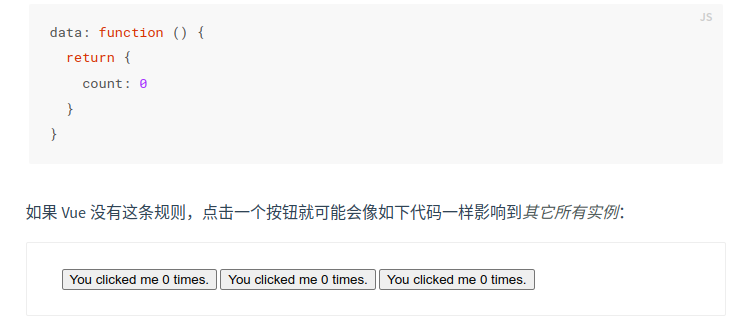
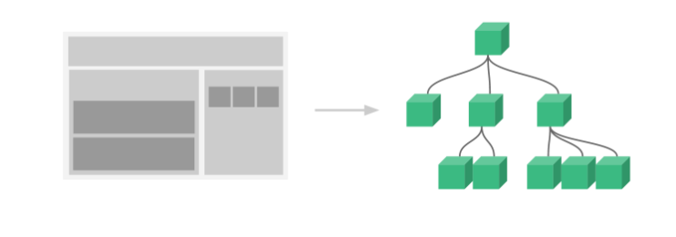

## :balloon: 组件 component

组件是可服用的Vue实例，且带有一个名字。可以通过以下代码创建：

```js
new Vue({el: '#component-demo'}) // el 表示挂载到id为component-demo的组件
```

---------

（1）一个组件的data选项必须是一个函数，因此每个实例可以维护一份**被返回对象的独立的拷贝**。



（2）一个应用通常会以一棵**嵌套的组件树**的形式来组织。



（3）组件需要注册后使用，有两种注册类型：

- 全局注册: 使用 `Vue.component`

- 局部注册: **???**

**全局注册代码：**

```js
Vue.component('my-component-name', {
  // ... options ...
})
```

https://v2.cn.vuejs.org/v2/guide/components.html

## :crystal_ball: 组件封装

  （1）全局注册（在main.js中）

- 创建一个xxx.vue

- 在main.js中引入`import xxx from 'xxx.vue'`

- 组件注册`Vue.Component('组件名','组件对象')`

- 把组件名在需要设置的某yyy.vue文件中当标签使用

（2）局部注册（在所需设置的某yyy.vue文件中）

- 创建一个xxx.vue

- 在所需设置的yyy.vue中引入`import xxx from 'xxx.vue'`

- 在yyy.vue文件中注册，语法为 `Components:{"组件名":"组件对象"}`

- 把组件名在yyy.vue中当做标签使用
