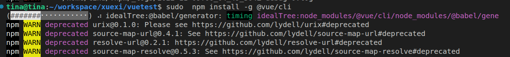
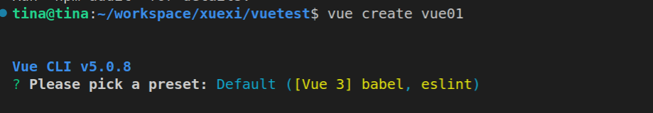
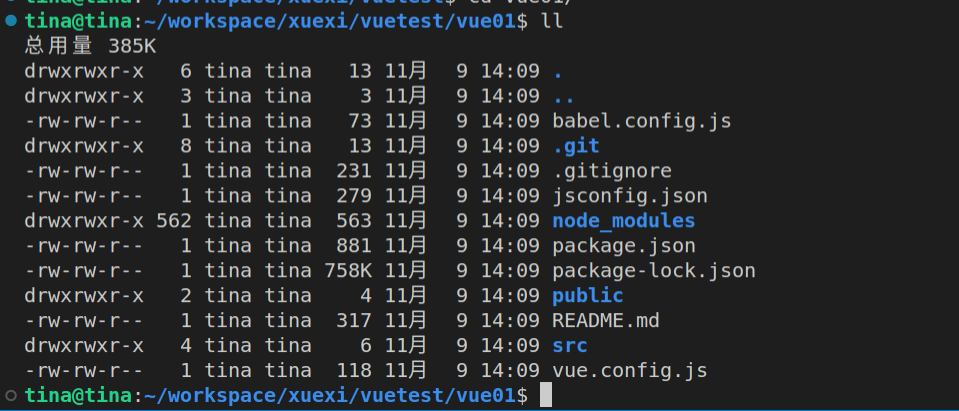

## 1. 搭建vue项目

（1）安装vue-cli

> npm install -g @vue/cli



（2）新建vue项目



执行完成后，会生成如下项目目录与文件：



每个文件夹的作用：

- src源码

- node_modules：存放依赖包

- dist：npm run build打包产生的静态资源文件，用于部署

- main.js 入口文件

- 


## 2. 知识点

Vue.js 的核心是一个允许采用简洁的模板语法来声明式地将数据渲染进 DOM 的系统：

```http
<div id="app">
  {{ message }}
</div>
```

```js
var app = new Vue({
  el: '#app',
  data: {
    message: 'Hello Vue!'
  }
})
```

:sunny: 注意: 不再直接写 HTML 文件，不再与HTML交互。 **一个 Vue 应用会将其挂载到一个 DOM 元素上**   (对于这个例子是 `#app`) ，然后对其进行完全控制。那个 **HTML 是我们的入口**，但其余都会发生在新创建的 Vue 实例内部。


