# Hololens打标文档

## 1. 设置局域网

1.1 将接mark服务端、unity软件计算机、Hololens**链接到同一个局域网**

1.2 确认Hololens的IP地址， mark服务端的IP地址

比如： 

- Hololens的IP地址为： `192.168.1.117`

- mark服务端的IP地址`192.168.1.155`

- unity计算机的IP地址`192.168.1.155`


## 2. unity脚本部署到Hololens

**需要注意：** 如果想将unity的脚本编译部署到Hololens上，需要导入MRTK包， 详情百度

https://docs.microsoft.com/zh-cn/windows/mixed-reality/mrtk-unity/?view=mrtkunity-2021-05

### 2.1 unity脚本IP修改

1 找到需要修改IP的文件

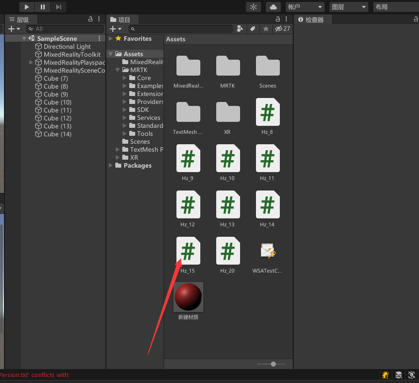

2. 修改IP和端口， 改为mark接收服务端的IP和端口

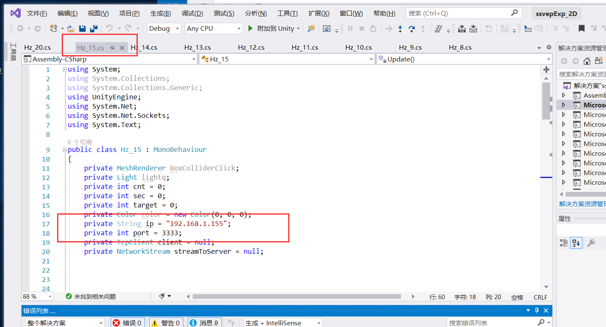


### 2.2 unity c#脚本打包编译

1. File -> 生成设置

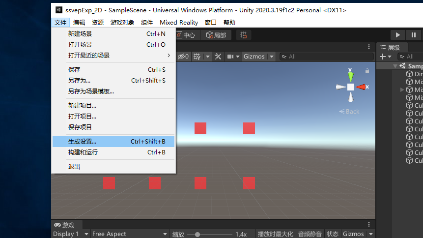


2. 设置

选择 `Universal Windows Platform`

具体配置如下: 

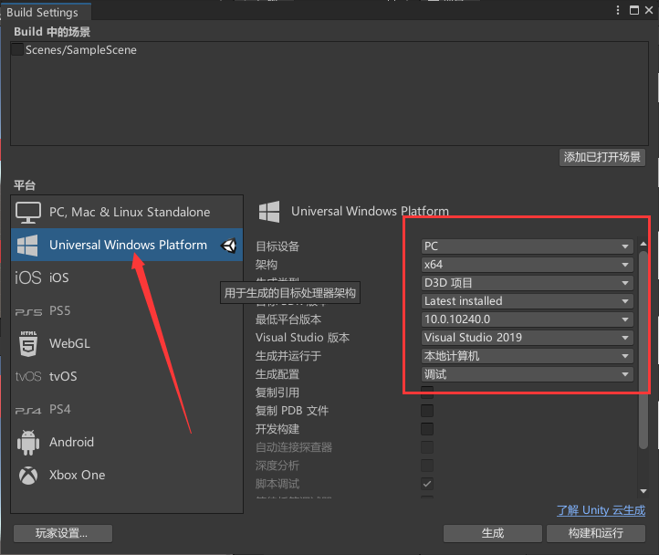

3. 点击生成

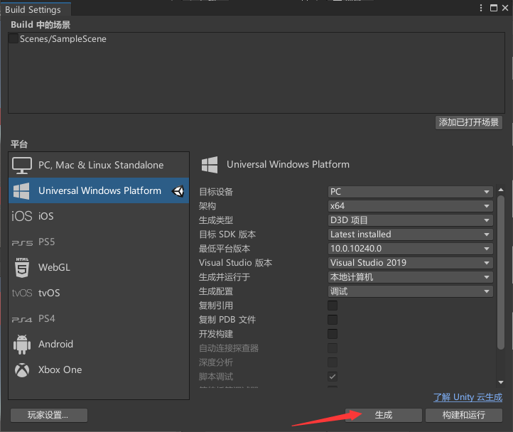

4. 选择生成文件夹

在项目目录下创建名为App的文件夹, 并选择该文件夹

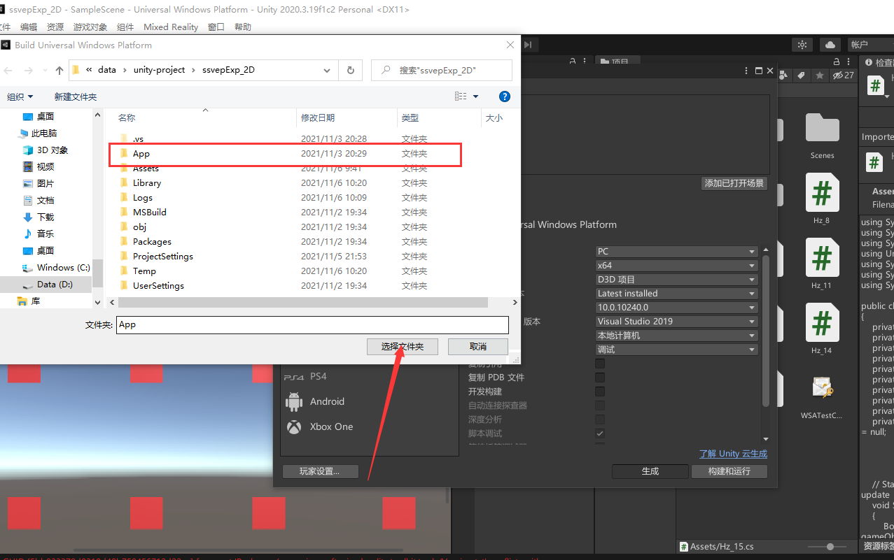


**注意： 生成配置需要和C++部署时需要一致**

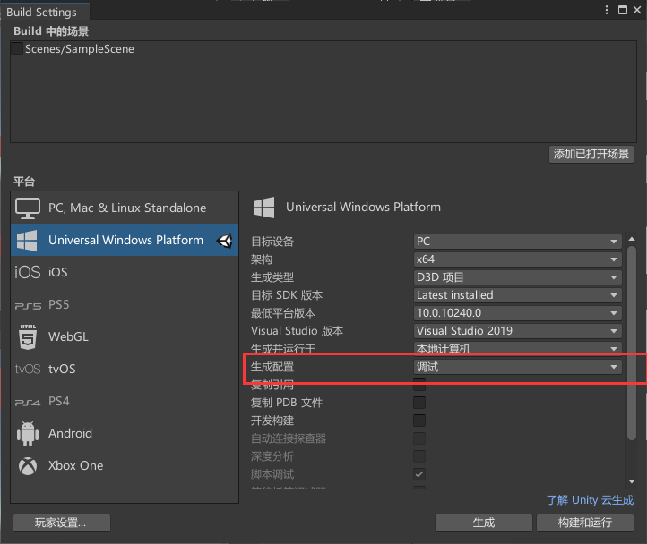


### 2.3 打开编译好的项目

#### 2.3.1 选择输出的App软件夹

然后打开`.sln`文件

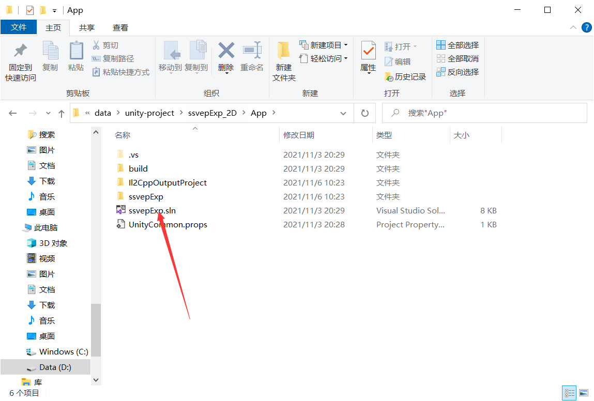


#### 2.3.2 配置编译

配置选择如下， 

- Debug, release, master的选择需要与unity中的配置一致， 

- 输出平台选择： 如果输出是Hololens模拟器， 则选择x86； 如果输出是Hololens平台，则选择ARM64

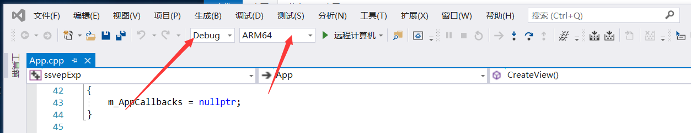


**输出如果是Hololens模拟器：**

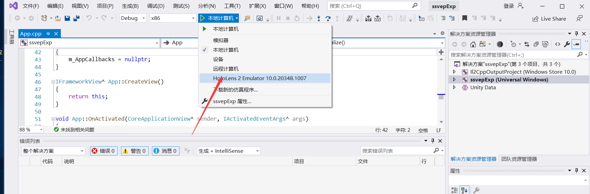


**输出如果是Hololens：**

1. 设置Hololens的IP

①选择项目属性

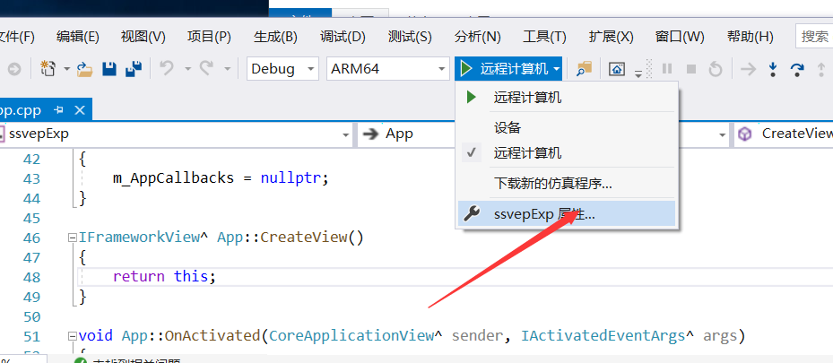

②选择调试， 设置计算机名， 计算机名为远程Hololens的IP

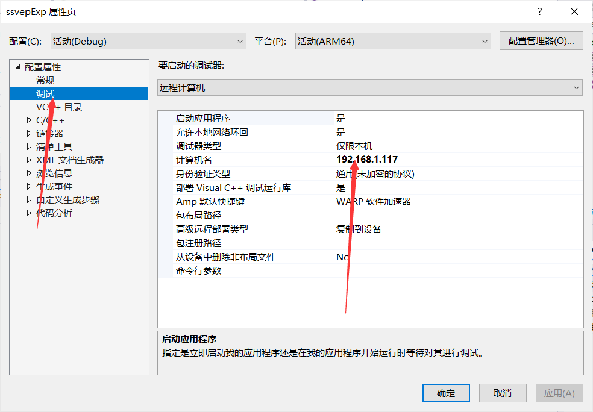

③编译运行

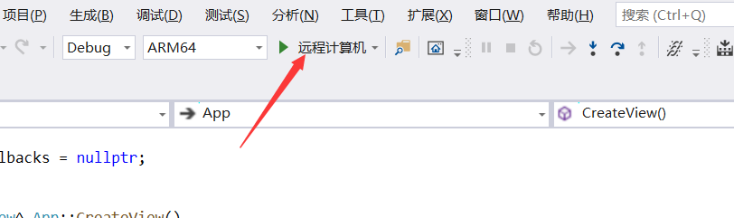

即可配置到Hololens上


## 3. mark打标接收器

实际上就是一个socket的服务端， 接收unity脚本中的客户端发送的mark信息， 然后转打到放大器上。

```python
import socket
import time

print("服务端开启")
# 创建套接字
mySocket = socket.socket(socket.AF_INET, socket.SOCK_STREAM)
# 设置IP和端口
# host = socket.gethostname()
host = '0.0.0.0'
port = 3333
# bind绑定该端口
mySocket.bind((host, port))
mySocket.setblocking(True)
# 监听
mySocket.listen(10)

print("等待连接....")
client, address = mySocket.accept()
print("新连接")
print("IP is %s" % address[0])
print("port is %d\n" % address[1])
while True:
    # 读取消息
    msg = client.recv(1024)
    aa = msg.decode("utf-8")
    if aa == '':
        client.close()
        break
    print("服务端接收:", aa)  # 把接收到的数据进行解码
    print("读取完成")


print("打标结束")

```


## 4. unity 闪烁脚本

**正弦波闪烁:**

```c#
using System;
using System.Collections;
using System.Collections.Generic;
using UnityEngine;
using System.Net;
using System.Net.Sockets;
using System.Text;

public class Hz_15 : MonoBehaviour
{
    private MeshRenderer BoxColliderClick;
    private Light lightq;
    private int cnt = 0;
    private int sec = 0;
    private int target = 0;
    private Color color = new Color(0, 0, 0);
    private String ip = "192.168.1.155";
    private int port = 3333;
    private TcpClient client = null;
    private NetworkStream streamToServer = null;


    // Start is called before the first frame update
    void Start()
    {
        BoxColliderClick = gameObject.GetComponent<MeshRenderer>();
        // lightq = this.GetComponent<Light>();
        Application.targetFrameRate = 60;
        //socket = new Socket(AddressFamily.InterNetwork, SocketType.Stream, ProtocolType.Tcp);
        //socket.Connect(ip, port);
        client = new TcpClient();
        try
        {
            client.Connect(IPAddress.Parse(ip), port);
            streamToServer = client.GetStream();//获得客户端的流
        }
        catch (Exception ex)
        {
            Debug.Log("客户端连接异常：" + ex.Message);
        }
    }

    // Update is called once per frame
    void Update()
    {
        //获取当前Ticks
        cnt++;
        if (cnt == 60)
        {
            cnt = 0;
            sec++;
        }
        if (sec == 6)
        {
            sec = 0;
        }
        if (sec == 0 && cnt == 0) {
            // 打标

            String msg = "cat"+(target) *10;
            if(streamToServer != null) // 如果流已经链接
            {
                byte[] buffer = Encoding.Unicode.GetBytes(msg);//将字符串转化为二进制
                streamToServer.Write(buffer, 0, buffer.Length);//将转换好的二进制数据写入流中并发送
            }
            target++;
            if(target == 9)
            {
                target = 1;
            }
        }

        if (sec == 0)
        {
            if(target == 1)
            {
                this.GetComponent<MeshRenderer>().material.color = Color.green;
                return;
            }
            else
            {
                this.GetComponent<MeshRenderer>().material.color = Color.red;
                return;
            }
            
        }
        else
        {
            float weight = (float)(1 + Math.Sin(2 * Math.PI * 15 * cnt / 60)) / 2;
            this.GetComponent<MeshRenderer>().material.color = new Color(weight, 0, 0);
        }


    }
}

```


如果还有问题，需要查询Hololens文档： 

https://docs.microsoft.com/zh-cn/windows/mixed-reality/develop/advanced-concepts/using-visual-studio?tabs=hl2


