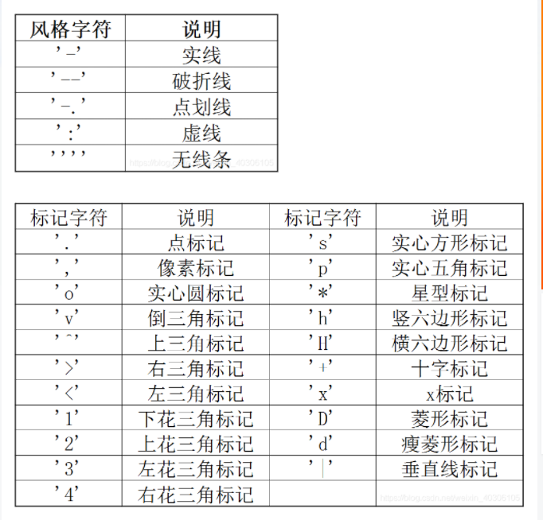

## 1. 画不同风格的折线图




```python
import matplotlib.pyplot as plt
import math
import matplotlib.font_manager as fm  # 字体管理器
# 解决中文乱码问题
import matplotlib
matplotlib.rcParams['font.sans-serif'] = ['SimHei']
matplotlib.rcParams['font.serif'] = ['SimHei']
matplotlib.rcParams['axes.unicode_minus'] = False # 解决保存图像是负号'-'显示为方块的问题,或者转换负号为字符串
# 解决中文乱码问题end

def itr(acc, time):
    N = 40  # 刺激目标数量
    p = acc  # 识别正确率
    T = time + 0.5  # 离线时间T: 识别数据长度+视觉引导时间0.5秒
    aa = (1 - p) / (N - 1)
    # print("math.log(10,2) : ", math.log(10, 2))
    B = math.log(N, 2) + p * math.log(p, 2) + (1 - p) * math.log(aa, 2)
    print("B-->", B)
    ITR = B * (60 / T)
    print("ITR-->", ITR)
    return ITR


time = [0.2, 0.3, 0.4, 0.5, 0.6, 0.7, 0.8, 0.9, 1.0]
plt.subplot(121)
acc1 = [45.51, 65.7, 78.63, 88.01, 92.28,  96.91, 97.38, 98, 98.14]  # my model
acc2 = [45, 57, 67, 74, 79, 84, 88, 91, 93]  # TSCORRCA
acc3 = [21, 37, 49, 60, 68, 75, 81, 85, 87]  # CORRCA
acc4 = [9, 16.5, 23, 30, 37, 46, 54.5, 61, 74]  # CCA
acc5 = [22, 35, 46.5, 55, 63, 73, 79, 83, 85.5]  # m-Extended-CCA
acc6 = [42.77, 56.83, 66.36, 73.08, 79.15, 84.55, 87.84, 90.5, 91.6]  # TODO ms-eTRCA
acc7 = [43, 62.6, 72.4, 79.78, 84.05, 89.55, 92.38, 94.5, 95.6]  # TODO ms-eCCA

ln1, = plt.plot(time, acc1, '--rv', color='red', linewidth=1.0)
ln2, = plt.plot(time, acc2, '--g+', color='blue', linewidth=1.0)
ln3, = plt.plot(time, acc3, '--d', color='olive', linewidth=1.0)
ln4, = plt.plot(time, acc4, '--bo', color='green', linewidth=1.0)
# ln5, = plt.plot(time, acc5, '-.rv', color='grey', linewidth=1.0)
ln6, = plt.plot(time, acc6, '--x', color='purple', linewidth=1.0)
ln7, = plt.plot(time, acc7, '--p', color='black', linewidth=1.0)

plt.title("ACC")  # 设置标题及字体

plt.legend(handles=[ln1, ln2, ln3, ln4,ln6, ln7], labels=['TAMB-CNN', 'CORRCA','TSCORRCA', 'CCA', 'ms-eTRCA', 'ms-eCCA'])


ax = plt.gca()
ax.spines['right'].set_color('none')  # right边框属性设置为none 不显示
ax.spines['top'].set_color('none')  # top边框属性设置为none 不显示
ax.set(xlabel='Time(s)', ylabel='Accuray(%)')

plt.subplot(122)

acc1 = [45.51, 65.7, 78.63, 88.01, 92.28,  96.91, 97.38, 98, 98.14]  # my model
acc2 = [45, 57, 67, 74, 79, 84, 88, 91, 93]  # TSCORRCA
acc3 = [21, 37, 49, 60, 68, 75, 81, 85, 87]  # CORRCA
acc4 = [9, 16.5, 23, 30, 37, 46, 54.5, 61, 74]  # CCA
acc5 = [22, 35, 46.5, 55, 63, 73, 79, 83, 85.5]  # m-Extended-CCA
# acc6 = [57, 73, 80, 84, 88.5, 91.5, 93.5, 95, 95.5]  # DNN-1
# acc7 = [61, 77, 84, 88, 91.5, 94, 95.5, 96.5, 97]  # DNN-2
acc6 = [42.77, 56.83, 66.36, 73.08, 79.15, 84.55, 87.84, 90.5, 91.6]  # TODO ms-eTRCA
acc7 = [43, 62.6, 72.4, 79.78, 84.05, 89.55, 92.38, 94.5, 95.6]  # TODO ms-eCCA
itr1 = []
itr2 = []
itr3 = []
itr4 = []
itr5 = []
itr6 = []
itr7 = []
for i in range(len(time)):
    itr1.append(itr(acc1[i]/100, time[i]))
    
    itr2.append(itr(acc2[i]/100, time[i]))
    itr3.append(itr(acc3[i]/100, time[i]))
    itr4.append(itr(acc4[i]/100, time[i]))
    itr5.append(itr(acc5[i]/100, time[i]))
    itr6.append(itr(acc6[i]/100, time[i]))
    itr7.append(itr(acc7[i]/100, time[i]))
# acc5 = [57, 73, 80, 84, 88.5, 91.5, 93.5, 95, 95.5]  # DNN
print(itr1)

ln1, = plt.plot(time, itr1, '--rv', color='red', linewidth=1.0)
ln2, = plt.plot(time, itr2, '--g+', color='blue', linewidth=1.0)
ln3, = plt.plot(time, itr3, '--d', color='olive', linewidth=1.0)
ln4, = plt.plot(time, itr4, '--bo', color='green', linewidth=1.0)
# ln5, = plt.plot(time, itr5, '-.rv', color='grey', linewidth=1.0)
ln6, = plt.plot(time, itr6, '-x', color='purple', linewidth=1.0)
ln7, = plt.plot(time, itr7, '-p', color='black', linewidth=1.0)

plt.title("ITR")  # 设置标题及字体

plt.legend(handles=[ln1, ln2, ln3, ln4, ln6, ln7], labels=['TAMB-CNN', 'CORRCA', 'TSCORRCA', 'CCA',  'ms-eTRCA', 'ms-eCCA'])

ax = plt.gca()
ax.spines['right'].set_color('none')  # right边框属性设置为none 不显示
ax.spines['top'].set_color('none')  # top边框属性设置为none 不显示
ax.set(xlabel='Time(s)', ylabel='bits/min')


plt.subplots_adjust(left=None, bottom=None, right=None, top=None,wspace=0.2, hspace=0.5)

plt.show()

```


## 2. 画混淆矩阵图

```python
import numpy as np
import matplotlib.pyplot as plt
import matplotlib
matplotlib.rcParams['font.sans-serif'] = ['SimHei']
matplotlib.rcParams['font.serif'] = ['SimHei']
matplotlib.rcParams['axes.unicode_minus'] = False # 解决保存图像是负号'-'显示为方块的问题,或者转换负号为字符串
# 解
def plot_confusion_matrix(conf_mat,
                          hide_spines=False,
                          hide_ticks=False,
                          figsize=None,
                          cmap=None,
                          colorbar=True,
                          show_absolute=True,
                          show_normed=False,
                          class_names=None,
                          figure=None,
                          axis=None):

    # 设置字体样式、大小
    plt.rc('font', family='Times New Roman', size='10')

    normed_conf_mat = conf_mat.astype('float')

    if figure is None and axis is None:
        fig, ax = plt.subplots(figsize=figsize)
    elif axis is None:
        fig = figure
        ax = fig.add_subplot(1, 1, 1)
    else:
        fig, ax = figure, axis

    ax.grid(False)
    # if cmap is None:
    cmap = plt.cm.coolwarm


    if figsize is None:
        figsize = (len(conf_mat)*1.25, len(conf_mat)*1.25)

    # 1.单元格颜色
    cm = conf_mat.copy()
    # for i in range(cm.shape[0]):
    #     for j in range(cm.shape[1]):
    #         if cm[i, j] >= 0 and cm[i, j] <= 5:
    #             cm[i, j] = 0
    #         elif cm[i, j] > 5 and cm[i, j] <= 20:
    #             cm[i, j] = 15
    #         elif cm[i, j] > 20:
    #             cm[i, j] = 30
    if show_normed:
        matshow = ax.matshow(cm, cmap=cmap, vmin=0, vmax=34)
    else:
        matshow = ax.matshow(cm, cmap=cmap)

    if colorbar:
        fig.colorbar(matshow)


    # 2. 单元格中的内容
    for i in range(conf_mat.shape[0]):
        for j in range(conf_mat.shape[1]):
            cell_text = ""
            if show_normed:
                cell_text += "\n "
                cell_text += format(conf_mat[i, j], 'd')  # todo 这里显示的是图中的个数
                cell_text += " \n"
                # cell_text += "\n" + '('
                # cell_text += format(normed_conf_mat[i, j], '.2f') + ')'
                # cell_text += format(normed_conf_mat[i, j]*100, '.2f')+'%'
                # if show_absolute:
                #     # cell_text += format(conf_mat[i, j], 'd')
                #     cell_text += "\n" + '('
                #     cell_text += format(conf_mat[i, j], 'd') + ')'

            else:
                cell_text += format(normed_conf_mat[i, j], '.2f')
            if show_normed:
                ax.text(x=j,
                        y=i,
                        s=cell_text,
                        va='center',
                        ha='center',
                        color="black" if normed_conf_mat[i, j] > 0.5
                        else "black")
            else:
                ax.text(x=j,
                        y=i,
                        s=cell_text,
                        va='center',
                        ha='center',
                        color="red" if conf_mat[i, j] > np.max(conf_mat)/2
                        else "black")

    # 通过绘制格网，模拟每个单元格的边框
    ax.set_xticks(np.arange(conf_mat.shape[1] + 1) - .5, minor=True)
    ax.set_yticks(np.arange(conf_mat.shape[0] + 1) - .5, minor=True)
    ax.grid(which="minor", color="black", linestyle='-', linewidth=0.1)
    ax.tick_params(which="minor", bottom=False, left=False)

    # 将x轴上的lables旋转40度
    if class_names is not None:
        tick_marks = np.arange(len(class_names))
        plt.xticks(tick_marks, class_names, rotation=40)  # rotation 坐标轴倾斜程度
        plt.yticks(tick_marks, class_names, rotation=0)

    if hide_spines:
        ax.spines['right'].set_visible(True)
        ax.spines['top'].set_visible(False)
        ax.spines['left'].set_visible(False)
        ax.spines['bottom'].set_visible(False)
    ax.yaxis.set_ticks_position('left')
    ax.xaxis.set_ticks_position('bottom')
    if hide_ticks:
        ax.axes.get_yaxis().set_ticks([])
        ax.axes.get_xaxis().set_ticks([])

    plt.xlabel('predicted label')
    plt.ylabel('true label')
    return fig, ax


class_name = ['8', '8.2', '8.4', '8.6', '8.8',
                  '9', '9.2', '9.4', '9.6', '9.8',
                  '10', '10.2', '10.4', '10.6', '10.8',
                  '11', '11.2', '11.4', '11.6', '11.8',
                  '12', '12.2', '12.4', '12.6', '12.8',
                  '13', '13.2', '13.4', '13.6', '13.8',
                  '14', '14.2', '14.4', '14.6', '14.8',
                  '15', '15.2', '15.4', '15.6', '15.8', ]

mat = np.load("all.npy")
fig, ax = plot_confusion_matrix(conf_mat=mat,
                                colorbar=True,
                                show_absolute=False,
                                show_normed=True,
                                figsize=(20, 30),
                                class_names=class_name)
plt.savefig('./confusion_matrix.png', dpi=300, bbox_inches='tight')
plt.show()
```

