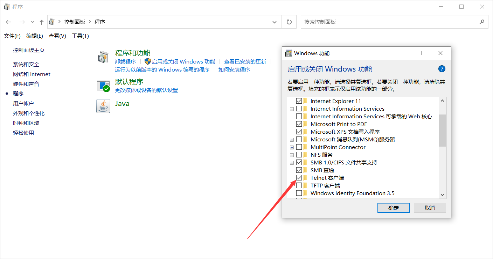

# CMD常规操作文档

## 1. 代理

**(1) CMD中设置临时代理**

```
set http_proxy=http://127.0.0.1:8888
set https_proxy=http:// 127.0.0.1:8888
```

**(2) 若代理服务器需要用户名和密码**

```
set http_proxy_user=xxx
set http_proxy_pass=xxx
```

**(3) 如果使用git时， git clone 下载速度慢**，因为git使用的是ssh协议

可以先设置代理，**再使用git的http仓库链接下载**。

## 

## 2. Telnet使用

**（1）安装**

telnet是windows的服务，但是使用前需要先安装

开始->控制面板->程序与功能->打开或关闭Windows功能->勾选Telnet客户端



**（2）使用**

```shell
telnet ip port // 例如： telnet 10.222.21.2 8080
```


