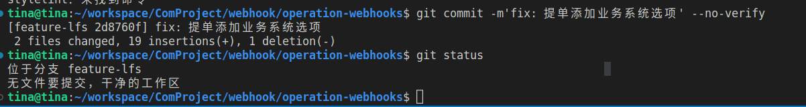

## 1. 修改分支名

> git branch -m oldname newname

## 2. 将master分支的内容更新下来再合并到自己分支

> git pull -r origin master

> git checkout lfs

> git merge master // 将master分支内容合并到自己的分支上, 这样就可以了

## 3. 远程删除分支

> git push origin --delete feat_name

**注意：** 删除远程分支后，记得删除本地分支

## 4. 前端代码跳过规则检查

> git commit -m'fix: 提单添加业务系统选项' --no-verify

