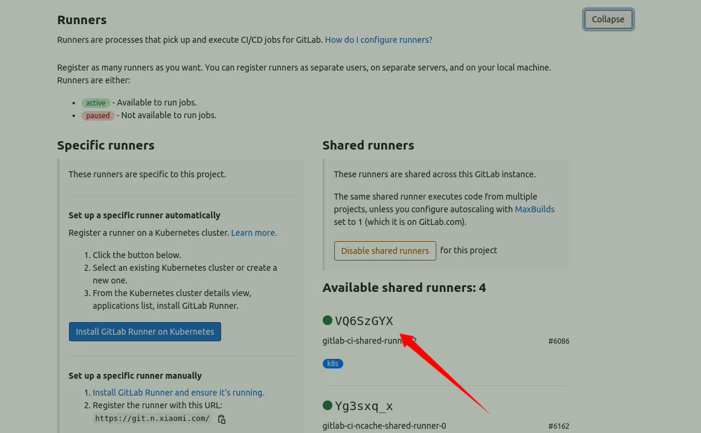
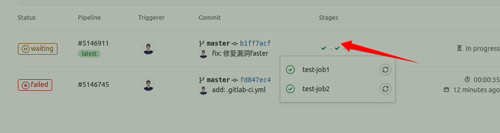

（1）将.gitlab-ci.yml文件添加到远程仓库的根目录

（2）将Gitlab项目配置为使用Runner

- Runner 可以在宿主机上去安装一个Runner，挂到项目上去跑

- 或者使用内部提供的Runner

(3)如果项目中有绿色的可以用的Runner， 则不需要再配置。

> settings-> CI/CD-> Runners



(4) 向.gitlab-ci.yml中添加

```yml
build-job:
  stage: build
  script:
    - echo "Hello, $GITLAB_USER_LOGIN!"

test-job1:
  stage: test
  script:
    - echo "This job tests something"

test-job2:
  stage: test
  script:
    - echo "This job tests something, but takes more time than test-job1."
    - echo "After the echo commands complete, it runs the sleep command for 20 seconds"
    - echo "which simulates a test that runs 20 seconds longer than test-job1"
    - sleep 20

deploy-prod:
  stage: deploy
  script:
    - echo "This job deploys something from the $CI_COMMIT_BRANCH branch."

```

（5）提交代码，gitlab中会自动执行gitlab-ci.yml中配置的任务：



可以看到执行的结果：

```shell
Running with gitlab-runner 13.12.0 (7a6612da)
  on gitlab-ci-shared-runner-2 VQ6SzGYX
Preparing the "kubernetes" executor
00:00
Using Kubernetes namespace: micode-cicd
Using Kubernetes executor with image micr.cloud.mioffice.cn/micode-cicd/gitlab-runner-default:v20230506 ...
Preparing environment
Waiting for pod micode-cicd/runner-vq6szgyx-project-110895-concurrent-0pmp9v to be running, status is Pending
	ContainersNotReady: "containers with unready status: [build helper]"
	ContainersNotReady: "containers with unready status: [build helper]"
Running on runner-vq6szgyx-project-110895-concurrent-0pmp9v via gitlab-ci-shared-runner-2...
Getting source from Git repository

Initialized empty Git repository in /builds/VQ6SzGYX/0/liufengshuang1/liufengshuang-test/.git/
Created fresh repository.
Checking out b1ff7acf as master...
Skipping Git submodules setup
Executing "step_script" stage of the job script
00:00
$ echo "Hello, $GITLAB_USER_LOGIN!"
Hello, liufengshuang!
Cleaning up file based variables
00:00
Job succeeded
```


