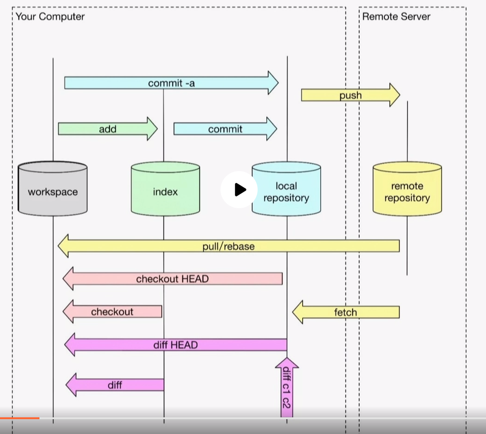
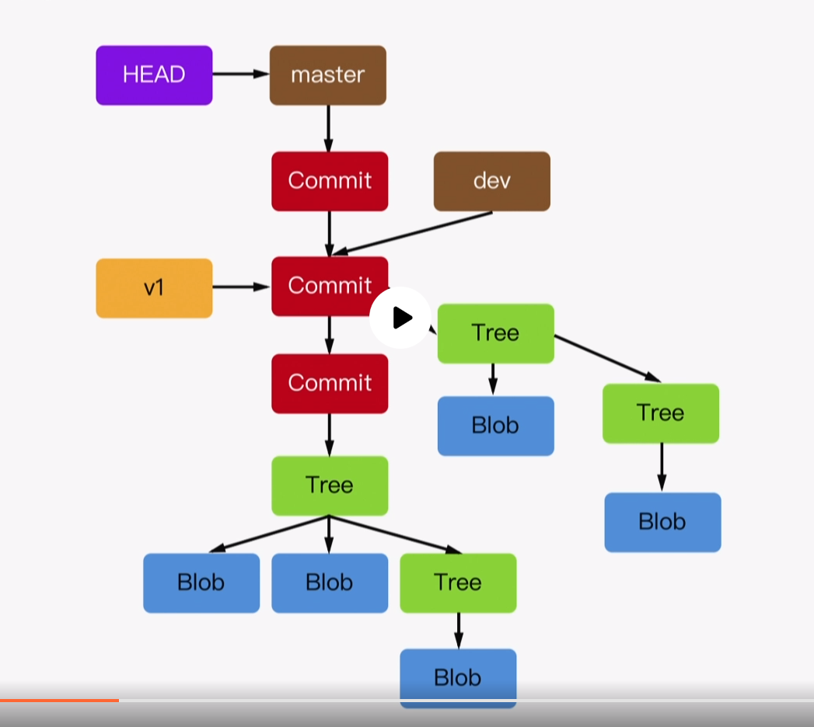
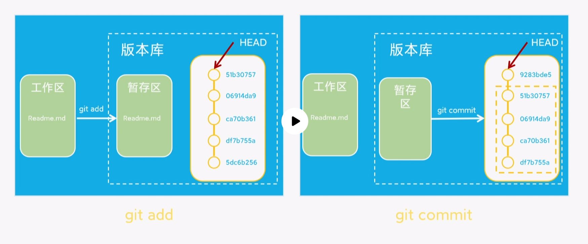
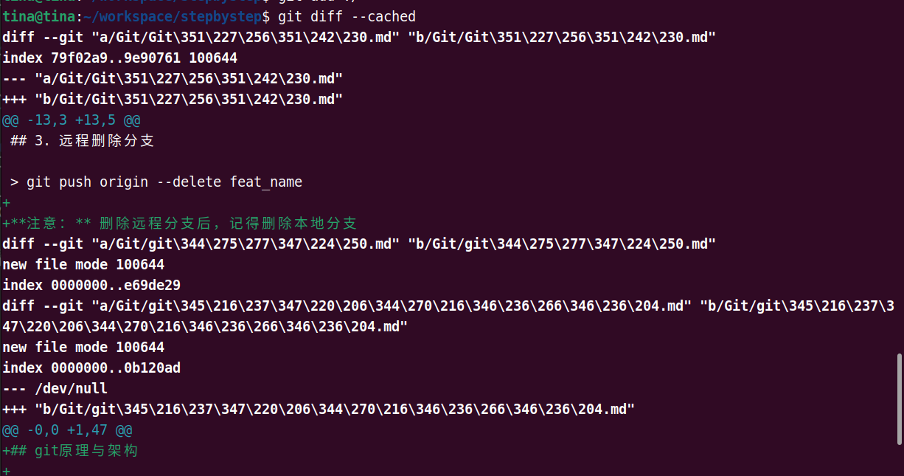
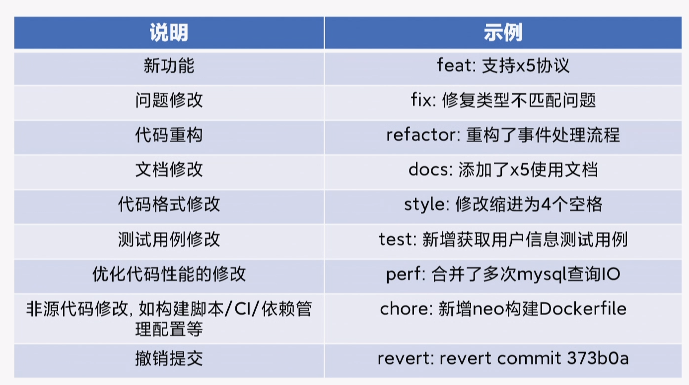

## git原理与架构

（1）架构

（2）存储

最基本的存储：Blob记录的是某个文件

Tree对应的是目录，目录下可以有子目录或者文件

任何一个源码目录都会对应一个唯一的Tree

当有一个Commit的时候，Commit会有一个指针指向某个时刻的Tree

分支和Tag都是指针

（3） **git这种设计为什么让操作变的如此之快？** :question:

记录版本变化一般有两种方法：

- 记录原始文件+记录每次修改的diff=通过原始文件+回放diff得到任意一个版本的文件

- 记录快照：在每次变化时都记录一个全新的快照【git采用】

git使用**快照**记录，所以每次修改都会产生新的Blob，所以让git在创建新的分支的时候会变得很快，因为快照是已经存在的，新的分支只是个指针，只需要创建一个指针即可，代价很小。可以让开发者随意创建分支，大大提高了多人开发下的效率。

而且，每次修改，才会创建Blob，git只会产生增量快照，不会产生增量快照，因此，不会占用很多空间。

（4）**.git文件夹就是存储git本地仓库的地方。**

（5）工作区和暂存区？

查看暂存区文件：

> git diff --cached

（6）git提交规范

