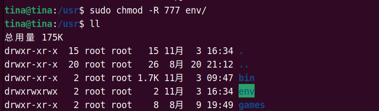
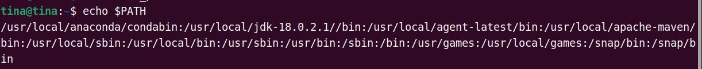
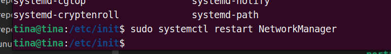
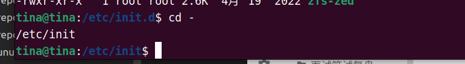
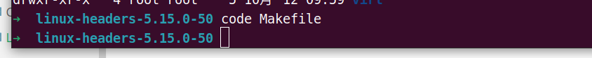

（1）进程相关操作

`gnome-system-monitor` 界面版资源管理器

（2）给文件夹及其文件修改权限

> chmod -R 777 path

其中： r=4,w=2,x=1

（3）添加可执行路径到`PATH`

查看当前`PATH`内容：

> echo $PATH

在`.bash_profile`文件中添加环境变量

（4）修改本地host文件

> vim /etc/hosts

> 127.0.0.1 localhost

> sudo  systemctl restart networkManager  # 重启网络服务

（5）回到上一目录

> cd -(减号)

（6）快捷键

Ctrl + a ：移到命令行首
Ctrl + e ：移到命令行尾
Ctrl + f ：按字符前移（右向）
Ctrl + b ：按字符后移（左向）
Alt + f ：按单词前移（右向）
Alt + b ：按单词后移（左向）
Ctrl + xx：在命令行首和光标之间移动
Ctrl + u ：从光标处删除至命令行首
Ctrl + k ：从光标处删除至命令行尾
Ctrl + w ：从光标处删除至字首
Alt + d ：从光标处删除至字尾
Ctrl + d ：删除光标处的字符
Ctrl + h ：删除光标前的字符
Ctrl + y ：粘贴至光标后
Alt + c ：从光标处更改为首字母大写的单词
Alt + u ：从光标处更改为全部大写的单词
Alt + l ：从光标处更改为全部小写的单词
Ctrl + t ：交换光标处和之前的字符
Alt + t ：交换光标处和之前的单词

（7）文本编辑器 命令行打开方式：

> code filename  // vscode

> 
