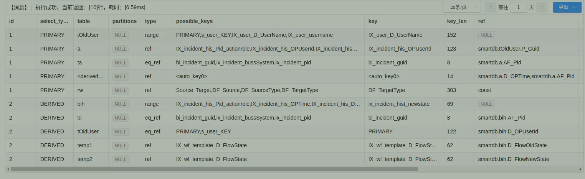

### 开始优化一条复杂SQL

**explain SQL** ， 用户查看一条SQL的执行计划，并看该SQL有无用上索引

例如

```sql
EXPLAIN select ta.DF_BusinessSystem, tOldUser.D_UserName,count(ta.D_Number)
from cccc as ta
         left join (select max(bih.D_OPTime) as resolveTime, bi.P_Guid as pid
                    from cccc as bi
                             left join yyyy as bih on bi.P_Guid = bih.AF_Pid
                             left join s_user tOldUser on tOldUser.p_guid = bih.D_OPUserId
                             left join mmmm temp1 on temp1.D_FlowState = bih.D_FlowOldState
                             left join mmmm temp2 on temp2.D_FlowState = bih.D_FlowNewState
                    where bih.D_FlowOldState != 'Record29'
                    and bih.D_FlowNewState = 'Record29'
                      and bih.D_OPTime >= '2023-02-09 00:00:00'
                      and bih.D_OPTime <= '2023-02-11 00:00:00'
                      and (bi.A_PId IS NULL OR bi.A_PId = 0)
                      and bi.DF_BusinessSystem in ('cf6e5a91125d0fdc')
                    GROUP by bi.P_Guid) as t
                   on t.pid = ta.P_Guid
         left join yyyy a on a.AF_Pid = TA.P_Guid and a.D_OPTime = t.resolveTime
         left join s_user tOldUser on tOldUser.p_guid = a.D_OPUserId
         left join ri_wf as rw  on rw.DF_Source = ta.P_Guid and rw.DF_SourceType = 'incident' and rw.DF_TargetType = 'fault'
where a.D_OPTime = t.resolveTime
and a.D_OPTime >= '2023-02-09 00:00:00'
and a.D_OPTime <= '2023-02-11 00:00:00'
  and ta.DF_BusinessSystem in ('xxxxxx')
  and (rw.P_Guid is null or rw.P_Guid = '')
  and (ta.A_PId IS NULL OR ta.A_PId = 0)
  and tOldUser.D_UserName in ('xxxx1','xxx2','p-xxxx3', 'p-xxxx4')
 GROUP by ta.DF_BusinessSystem, tOldUser.D_UserName
```

**通过看其返回结果， 来进行优化：**



**返回结果怎么看？**

[MySQL EXPLAIN 详解 - 掘金](https://juejin.cn/post/6953444668973514789)
