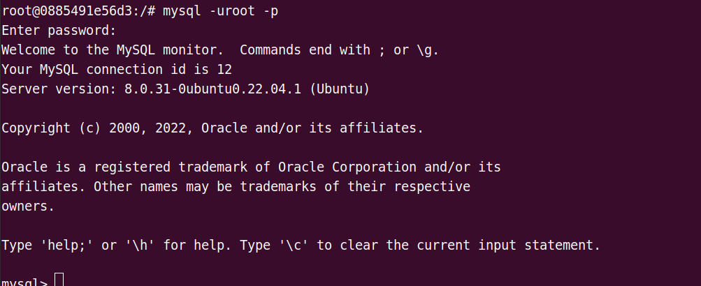
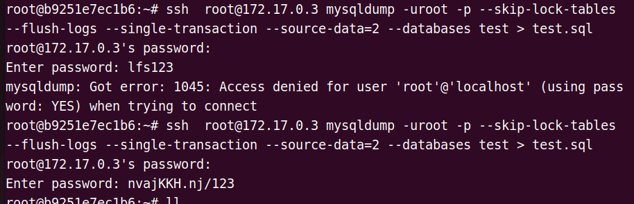
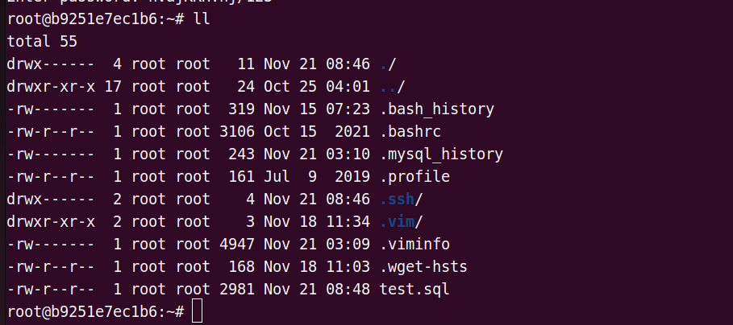
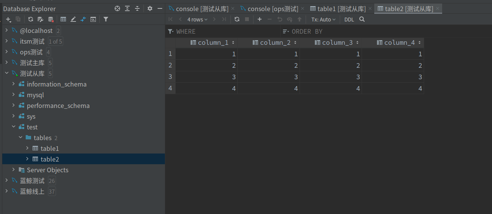
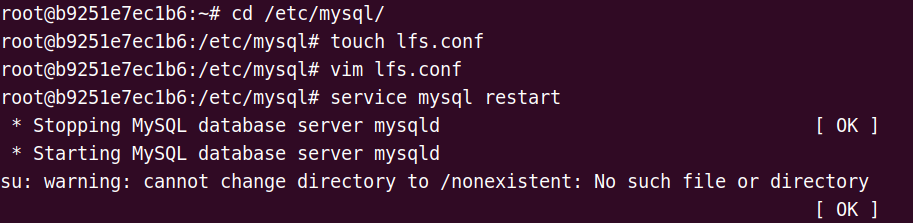

1. **远程登录**

>  mysql -h 10.95.32.16 -u root -p


2. **开启root远程访问权限**

(1) 本地登录root

> mysql -uroot -p xxx



(2)切换数据库

> use mysql

(3)操作

```sql
mysql> use mysql
Reading table information for completion of table and column names
You can turn off this feature to get a quicker startup with -A

Database changed
mysql> update user set host = '%' where user = 'root';
Query OK, 1 row affected (0.02 sec)
Rows matched: 1  Changed: 1  Warnings: 0

mysql> flush privileges;
Query OK, 0 rows affected (0.01 sec)

mysql> select host,user,authentication_string from user;
+-----------+------------------+------------------------------------------------------------------------+
| host      | user             | authentication_string                                                  |
+-----------+------------------+------------------------------------------------------------------------+
| %         | root             | *A6083A2C361B2AD79176B87076A4EC32DE50EF97                              |
| localhost | debian-sys-maint | $A$005$-(`hjE
                                              :=k:KaFKF5UJWlnybgKu8ump4IDVyYCTzSk5i6ZncrgM3TH6 |
| localhost | mysql.infoschema | $A$005$THISISACOMBINATIONOFINVALIDSALTANDPASSWORDTHATMUSTNEVERBRBEUSED |
| localhost | mysql.session    | $A$005$THISISACOMBINATIONOFINVALIDSALTANDPASSWORDTHATMUSTNEVERBRBEUSED |
| localhost | mysql.sys        | $A$005$THISISACOMBINATIONOFINVALIDSALTANDPASSWORDTHATMUSTNEVERBRBEUSED |
+-----------+------------------+------------------------------------------------------------------------+
5 rows in set (0.00 sec)

mysql> exit
```

(4) 设置远程所有权限

```sql
mysql> GRANT ALL ON *.* TO 'root'@'%';
Query OK, 0 rows affected (0.02 sec)

mysql> flush privileges;
Query OK, 0 rows affected (0.01 sec)

mysql> select host, user, authentication_string, plugin from user; 
+-----------+------------------+------------------------------------------------------------------------+-----------------------+
| host      | user             | authentication_string                                                  | plugin                |
+-----------+------------------+------------------------------------------------------------------------+-----------------------+
| %         | root             | *A6083A2C361B2AD79176B87076A4EC32DE50EF97                              | mysql_native_password |
| localhost | debian-sys-maint | $A$005$-(`hjE
                                              :=k:KaFKF5UJWlnybgKu8ump4IDVyYCTzSk5i6ZncrgM3TH6 | caching_sha2_password |
| localhost | mysql.infoschema | $A$005$THISISACOMBINATIONOFINVALIDSALTANDPASSWORDTHATMUSTNEVERBRBEUSED | caching_sha2_password |
| localhost | mysql.session    | $A$005$THISISACOMBINATIONOFINVALIDSALTANDPASSWORDTHATMUSTNEVERBRBEUSED | caching_sha2_password |
| localhost | mysql.sys        | $A$005$THISISACOMBINATIONOFINVALIDSALTANDPASSWORDTHATMUSTNEVERBRBEUSED | caching_sha2_password |
+-----------+------------------+------------------------------------------------------------------------+-----------------------+
5 rows in set (0.00 sec)

mysql> 
```

然后， 修改vim mysqld.cnf 文件，将bind-addredd设置为: `0.0.0.0`


最后，看3306端口是否开放

> netstat -ant


2. **数据库主从配置**

（1）主库配置

在/etc/mysql/conf.d/文件夹下创建配置文件`lfs.conf`

```
[mysqld]
server-id=1 # 数据库ID, 全局唯一
log-bin=mysql-bin
binlog-ignore-db=mysql # 不更新的库 
binlog-do-db=test # 需要更新的库
```

（2）重启数据库

> service mysql restart

（3）登录root， 并创建主从用户cpuser

```sql
root@0885491e56d3:/etc/mysql# mysql -uroot -p
Enter password: 
Welcome to the MySQL monitor.  Commands end with ; or \g.
Your MySQL connection id is 10
Server version: 8.0.31-0ubuntu0.22.04.1 (Ubuntu)

mysql> use mysql
Reading table information for completion of table and column names
You can turn off this feature to get a quicker startup with -A

Database changed
mysql> create user  'cpuser'@'%' identified with mysql_native_password by 'nvajKKH.nj/123';
Query OK, 0 rows affected (0.04 sec)

mysql> grant replication slave on *.* to 'cpuser'@'%';
Query OK, 0 rows affected (0.01 sec)

mysql> flush privileges;
Query OK, 0 rows affected (0.01 sec)

mysql> show master status;  # 查看主库状态
+---------------+----------+--------------+------------------+-------------------+
| File          | Position | Binlog_Do_DB | Binlog_Ignore_DB | Executed_Gtid_Set |
+---------------+----------+--------------+------------------+-------------------+
| binlog.000008 |      838 |              |                  |                   |
+---------------+----------+--------------+------------------+-------------------+
1 row in set (0.0
```

（3）在从库服务器上登录主库服务端，然后导出sql（第一次密码：服务器root用户密码，第二次是数据库root密码）

> ssh  root@172.17.0.3 mysqldump -uroot -p --skip-lock-tables --flush-logs --single-transaction --source-data=2 --databases test > test.sql



可以看到sql已经到本地：



（4）执行导出的sql

> mysql -uroot -p < test.sql


（5）最后看到从库中也有了主库的数据



（6）然后配置从库

在从库服务器的 **/etc/mysql/conf.d/** (下图中目录有问题)下创建lfs.cnf，内容如下：

```
[mysqld]
server-id=2
```

重启数据库



（7）从库配置主库

> change master to master_host='172.17.0.3',master_port=3306,master_user='cpuser',master_password='nvajKKH.nj/123',master_log_file='binlog.000009',master_log_pos=157;

注意： 这里的`master_log_file` 和 `master_loag_pos`要和主库中查的`show master status; `结果一致。

**以下为从库配置:**

```sql
root@b9251e7ec1b6:/etc/mysql# mysql -uroot -p
Enter password: 
Welcome to the MySQL monitor.  Commands end with ; or \g.
Your MySQL connection id is 16
Server version: 8.0.31-0ubuntu0.22.04.1 (Ubuntu)

Copyright (c) 2000, 2022, Oracle and/or its affiliates.

Oracle is a registered trademark of Oracle Corporation and/or its
affiliates. Other names may be trademarks of their respective
owners.

Type 'help;' or '\h' for help. Type '\c' to clear the current input statement.

mysql> change master to master_host='172.17.0.3',master_port=3306,master_user='cpuser',master_password='nvajKKH.nj/123',master_log_file='binlog.000009',master_log_pos=157;

mysql> start slave;
Query OK, 0 rows affected, 1 warning (0.01 sec)

mysql> show slave status\G;
*************************** 1. row ***************************
               Slave_IO_State: Waiting for source to send event
                  Master_Host: 172.17.0.3
                  Master_User: cpuser
                  Master_Port: 3306
                Connect_Retry: 60
              Master_Log_File: binlog.000009
          Read_Master_Log_Pos: 444
               Relay_Log_File: b9251e7ec1b6-relay-bin.000004
                Relay_Log_Pos: 610
        Relay_Master_Log_File: binlog.000009
             Slave_IO_Running: Yes
            Slave_SQL_Running: Yes
              Replicate_Do_DB: 
          Replicate_Ignore_DB: 
           Replicate_Do_Table: 
       Replicate_Ignore_Table: 
      Replicate_Wild_Do_Table: 
  Replicate_Wild_Ignore_Table: 
                   Last_Errno: 0
                   Last_Error: 
                 Skip_Counter: 0
          Exec_Master_Log_Pos: 444
              Relay_Log_Space: 1007
              Until_Condition: None
               Until_Log_File: 
                Until_Log_Pos: 0
           Master_SSL_Allowed: No
           Master_SSL_CA_File: 
           Master_SSL_CA_Path: 
              Master_SSL_Cert: 
            Master_SSL_Cipher: 
               Master_SSL_Key: 
        Seconds_Behind_Master: 0
Master_SSL_Verify_Server_Cert: No
                Last_IO_Errno: 0
                Last_IO_Error: 
               Last_SQL_Errno: 0
               Last_SQL_Error: 
  Replicate_Ignore_Server_Ids: 
             Master_Server_Id: 1
                  Master_UUID: 1f573acd-6735-11ed-bc3c-0242ac110003
             Master_Info_File: mysql.slave_master_info
                    SQL_Delay: 0
          SQL_Remaining_Delay: NULL
      Slave_SQL_Running_State: Replica has read all relay log; waiting for more updates
           Master_Retry_Count: 86400
                  Master_Bind: 
      Last_IO_Error_Timestamp: 
     Last_SQL_Error_Timestamp: 
               Master_SSL_Crl: 
           Master_SSL_Crlpath: 
           Retrieved_Gtid_Set: 
            Executed_Gtid_Set: 
                Auto_Position: 0
         Replicate_Rewrite_DB: 
                 Channel_Name: 
           Master_TLS_Version: 
       Master_public_key_path: 
        Get_master_public_key: 0
            Network_Namespace: 
1 row in set, 1 warning (0.00 sec)

ERROR: 
No query specified

mysql> exit
Bye
root@b9251e7ec1b6:/etc/mysql# 
```

如果结果是Yes， Yes，则同步成功。


**注意：**

如果`Slave_IO_Running: No`, 则可能的原因：

- 防火墙没开

- 密码不对      #MySQL重新授权远程用户登陆账号，重新设置密码，排除

- ID问题        #ID的问题，在安装完mysql数据库的时候默认他们的server-id=1 但是在做主从同步的时候需要将ID号码设置不一样才行,查看数据库配置文件cat  /etc/my.cnf，文件写的不同，排除

- pos不正确     #主服务器,登陆数据库重新查看起始偏移量show master status,排除

- 防火墙策略

- 网络不通      #互ping机器ip，无丢包率正常访问，排除
