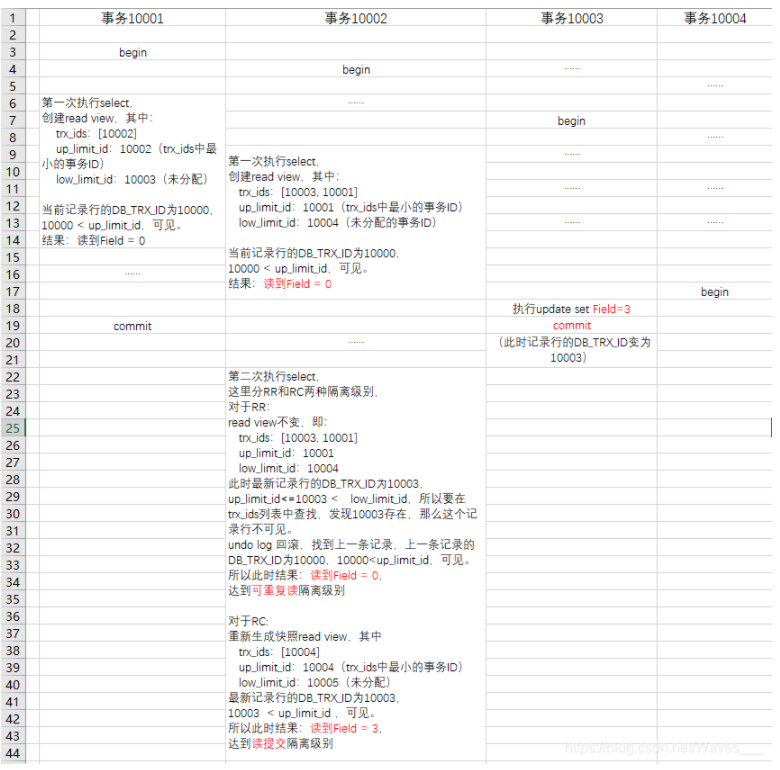

# 数据库的四种隔离级别

## 1. 总述

### 1.1 事务的特点：

- **原子性**：事务所包含的操作，要么全部完成，要么全部失败回滚。
- **一致性**：事务在执行前后，数据库必须保持一致。
- <font color='red'>**隔离性**</font>：**一个事务在执行过程中，不能被其他事务影响。**
- **持久性**：事务执行完成后，会被永久保存在数据库中。


事务的写法：

```sql
begin;
update user set money=money+100 where userid=1;
commit;
```


### 1.2 事务的隔离性所引发的问题

#### 1.2.1 脏读

```sql
       事务1                        |                事务2                
begin;                             |  begin;
select age from user where id=1;   |  update user set age = 22 where id=1;
                                   |
select age from user where id=1;   |  
commit;                            |  rollback;

```

这样读到了别人rollback之前做了修改的内容，就叫做脏读。


#### 1.2.2 不可重复读

```sql
       事务1                        |                事务2                
begin;                             |  begin;
select age from user where id=1;   |  update user set age = 22 where id=1;
                                   |  commit;
select age from user where id=1;   |  
commit;                            |  
```

对于事务1来说，前后读的结果不同，读到了别人`commit`之后的数据，叫做不可重复读。


#### 1.2.3 幻读

```sql
       事务1                        |                事务2                
begin;                             |  begin;
select age from user where id>1;   |  insert user values(3, "mark", 32);
                                   |  commit;
select age from user where id>1;   |  
commit;                            |  
```

对于事务1来说，新增数据破坏了前后数据一致性，称为幻读。


### 1.3 数据库隔离级别：

针对1.2中的三种问题，不同的隔离级别解决的问题的数量不一样。


- **`Serializable`**：使用事务串行化调度，避免出现因为插入数据没法加锁导致的不一致的情况
- **`Repeatable Read`**：使用读锁和写锁，解决不可重复读的问题，但会有幻读 （`MySQL`隔离级别）
- **`Read committed`**：使用写锁，但是读会出现不一致，不可重复度（Oracle隔离级别）， 解决读已提交问题
- **`Read Uncommitted`**：读写均不使用锁，数据的一致性最差。什么问题也不解决。


## 2. 实现可重复读的原理？？`MVCC`

`MVCC`（多版本并发控制）：

`MVCC`是一种用来解决读-写冲突的无锁并发控制，也就是为事务分配单向增长的时间戳，①为**每个修改保存一个版本**，②**版本与事务时间戳相关联**，③**读操作只读该事务开始前的数据库的快照**。

最早的数据库系统，只有读读之间可以并发，读写，写读，写写都要阻塞。引入多版本之后，**只有写写之间相互阻塞**，其他三种操作都可以并行，这样大幅度提高了`InnoDB`的并发度。

### 2.1 `MVCC`实现方式？？

[MySQL :: MySQL 5.7 Reference Manual :: 14.3 InnoDB Multi-Versioning](https://dev.mysql.com/doc/refman/5.7/en/innodb-multi-versioning.html)

`MVCC`的实现依赖于

- 隐藏字段
- `Read View`
- `undo log`

#### 2.1.1 隐藏字段

` InnoDB`存储引擎在每行数据的后面添加了三个隐藏字段：

- `DB_TRX_ID`（6字节）：表示**最近一次对本记录行做修改（`insert|update`）的事务ID**。
- `DB_ROLL_PTR`（7字节）：**回滚指针，指向当前记录行的`undo log` 信息**。

- `DB_ROW_ID`（6字节）：随着新行插入而单调递增的行`ID`。（当表中没有主键或者唯一非空索引时，`innodb`就会使用这个行ID自动产生聚簇索引。）


#### <font color='red'>2.1.2 `Read View` 结构体</font>

[Read View 源码](https://github.com/facebook/mysql-5.6/blob/42a5444d52f264682c7805bf8117dd884095c476/storage/innobase/include/read0read.h#L125)

```C
struct read_view_t{
	ulint		type;	/*!< VIEW_NORMAL, VIEW_HIGH_GRANULARITY */
	undo_no_t	undo_no;/*!< 0 or if type is
				VIEW_HIGH_GRANULARITY
				transaction undo_no when this high-granularity
				consistent read view was created */
	trx_id_t	low_limit_no;
				/*!< The view does not need to see the undo
				logs for transactions whose transaction number
				is strictly smaller (<) than this value: they
				can be removed in purge if not needed by other
				views */
	trx_id_t	low_limit_id; /* 下一个将要被分配的事务ID -> 高水位*/
				/*!< The read should not see any transaction
				with trx id >= this value. In other words,
				this is the "high water mark". */
	trx_id_t	up_limit_id;   /* 下一个将要被分配的事务ID -> 低水位*/
				/*!< The read should see all trx ids which
				are strictly smaller (<) than this value.
				In other words,
				this is the "low water mark". */
	ulint		n_trx_ids;  /* trx_ids array 数组的大小*/
				/*!< Number of cells in the trx_ids array */
	trx_id_t*	trx_ids; /* Read View 创建时其他未提交的活跃事务ID列表， 
						位于高水位和低水位之间*/
    			/*!< Additional trx ids which the read should
				not see: typically, these are the read-write
				active transactions at the time when the read
				is serialized, except the reading transaction
				itself; the trx ids in this array are in a
				descending order. These trx_ids should be
				between the "low" and "high" water marks,
				that is, up_limit_id and low_limit_id. */
	trx_id_t	creator_trx_id;  /* 当前创建事务的ID*/
				/*!< trx id of creating transaction, or
				0 used in purge */
	UT_LIST_NODE_T(read_view_t) view_list;
				/*!< List of read views in trx_sys */
};

```


#### 2.1.3 `Undo log`

`Undo log`中存储的是老版本数据，当一个事务需要读取记录行是，如果当前记录行不可见，可以顺着`undo log`链找到满足其可见性条件的记录行版本。


大多数对数据的变更操作包括：` insert `/ `update`  / `delete` 。

 在`InnoDB`中， `undo log`分为两类：

- `insert undo log`: 事务对`insert`新记录时产生的`undo log`， 只在事务混滚时需要，并且在事务提交后就可以立即丢弃。
- `update undo log`： 事务对记录进行`delete`和`update`操作时产生的`undo log`， 不仅在事务回滚时需要，快照读也需要，只有当数据库所使用的快照中不涉及该日志记录，对应的回滚日志才会被`purge`线程删除。


#### 2.1.4 `purge `线程

**purge线程**：为了实现`InnoDB`的`MVCC`机制，**更新或者删除操作都只是设置一下旧记录的`deleted_bit`**，**并不真正将旧记录删除**。
        为了节省磁盘空间，`InnoDB`有专门的`purge`线程来清理`deleted_bit`为`true`的记录。`purge`线程自己也维护了一个`read view`，如果某个记录的`deleted_bit`为`true`，并且`DB_TRX_ID`相对于`purge`线程的`read view`可见，那么这条记录一定是可以被安全清除的。


#### 2.1.5 记录修改的具体流程

一条记录的字段如下：

| `name`  | `Honor` | `DB_TRX_ID`(事务ID) | `DB_ROLL_PTR`（回滚指针） | `DB_ROW_ID` |
| ------- | ------- | ------------------- | ------------------------- | ----------- |
| `curry` | `mvp`   | `1`                 | `Ox23636354`              | -           |


##### 2.1.5.1 事务A（事务ID为2）对该记录的`Honor`字段进行修改，将`Honor`改为`fmvp`

​	① 事务A先对该行添加**排他锁**

​	②然后把该行数据拷贝到`undo log`中， 作为旧版本

​	③拷贝完毕后，修改该行的`Honor`字段值为`fmvp`, 并修改`DB_TRX_ID=2`(事务A的ID)， 回滚指针指向`undo log`拷贝到`undo log`的旧版本。

​	④事务提交，释放排他锁

结果：

当前行：(回滚指针指向undo log的行地址)

| name    | Honor  | DB_TRX_ID(事务ID) | DB_ROLL_PTR（回滚指针） | DB_ROW_ID |
| ------- | ------ | ----------------- | ----------------------- | --------- |
| `curry` | `fmvp` | 2                 | `Ox344585454`           | -         |

`undo log` ：

| name    | Honor | DB_TRX_ID(事务ID) | DB_ROLL_PTR（回滚指针） | DB_ROW_ID |
| ------- | ----- | ----------------- | ----------------------- | --------- |
| `curry` | `mvp` | `1`               | `Ox23636354`            | -         |


##### 2.1.5.2 事务B（事务ID为3）对该记录的`Honor`字段进行修改，将`name`改为`shuang`

​	① 事务B先对该行添加**排他锁**

​	②然后把该行数据拷贝到`undo log`中， 作为旧版本

​	③拷贝完毕后，修改该行的`name`字段值为`shuang`, 并修改`DB_TRX_ID=3`(事务B的ID)， 回滚指针指向`undo log`拷贝到`undo log`的旧版本。

​	④事务提交，释放排他锁


当前行：(回滚指针指向`undo log`的行地址)

| name     | Honor  | DB_TRX_ID(事务ID) | DB_ROLL_PTR（回滚指针） | DB_ROW_ID |
| -------- | ------ | ----------------- | ----------------------- | --------- |
| `shuang` | `fmvp` | 3                 | `Ox334458542`           | -         |

`undo log` (地址 `Ox334458542` )：

| name    | Honor  | DB_TRX_ID(事务ID) | DB_ROLL_PTR（回滚指针） | DB_ROW_ID |
| ------- | ------ | ----------------- | ----------------------- | --------- |
| `curry` | `fmvp` | 2                 | `Ox344585454`           | -         |

`undo log`(地址`x344585454` ) ：

| name    | Honor | DB_TRX_ID(事务ID) | DB_ROLL_PTR（回滚指针） | DB_ROW_ID |
| ------- | ----- | ----------------- | ----------------------- | --------- |
| `curry` | `mvp` | `1`               | `Ox23636354`            | -         |


### 2.2 可见性比较算法

在`Innodb`中，<font color='red'>创建一个新事务后，执行第一个`select`语句的时候</font>，`innodb`会创建一个<font color='red'>快照 ( `Read view` )</font>，**快照中会保存系统当前不应该被本事务看到的其他活跃事务id列表**（即`trx_ids`）。当用户在这个事务中要读取某个记录行的时候，`innodb`会将该记录行的`DB_TRX_ID`与 `Read view `中的一些遍历进行比较，判断是否满足可见性条件。


**描述：**

假设当前事务要读取某一记录行，

​	该记录行的`DB_TRX_ID`（最新修改该行的事务ID）为`trx_id`， 

​	`Read view`的活跃事务列表`trx_ids`中最早的事务ID为`up_limit_id`，（当前事务开始后第一个事务ID）

​	在生产这个`Read view `时系统出现过的最大的事务ID+1记为`low_limit_id`（创建该`Read View`结束前的最后一个事务ID）。


----------------------------------------

① 如果`trx_id <  up_limit_id`, 那么表明“最新修改该行的事务”在当前事务创建快照之前就提交了，所以该记录行的值对当前事务时可见的，该可见行的值返回。

② 如果`trx_id >= low_limit_id`， 那么表明“最新修改该行的事务”在"当前事务"创建快照之后才修改改行，所以该记录行的值对当前事务不可见。

③ 如果 `up_limit_id <= trx_id <= low_limit_id`， 表明“最新修改该行的事务”在“当前事务”创建快照的时候可能处于“活动状态”或者"已提交状态", 所以要对活跃事务列表`trx_ids`进行查找。

​		(1)如果活跃事务列表`trx_ids`中能找到`id`为`trx_id`的事务，表明： 在当前事务创建快照前，该记录行的值被`id`为`trx_id`的事务修改了，不管有没有提交，这种情况下，这个记录行的值对于当前事务都是不可见的。

​		(2)在活跃事务列表中找不到，表明`id`为`trx_id`的事务在修改该记录的值只有，在当前事务创建快照前就已经提交了，所以记录对于当前事务可见。返回该可见行的值。

④ 在该记录行的`DB_ROLL_PTR`指针所指向的`undo log`回滚段中，取出最先的旧事务号`DB_TRX_ID`，然后跳到步骤①重新开始判断。

​	


### 2.3 例子




[(24条消息) MySQL中MVCC的正确打开方式（源码佐证）_Waves___的博客-CSDN博客](https://blog.csdn.net/waves___/article/details/105295060)

