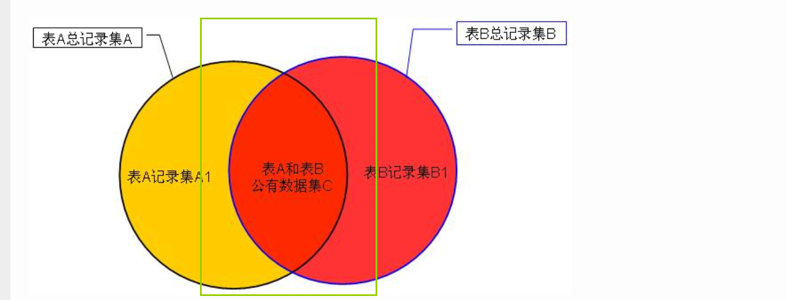

# 数据库基础

## 1. 关系型数据库和非关系型数据库

### 1.1 关系数据库和非关系数据库有哪些？？

关系数据库有哪些？？（**有`sql`，事务一致性，二维表格模型**）

- `Oracle`
- `DB2`
- `Microsoft SQL Server`
- `Microsoft Access`
- `MySQL`

非关系数据库？？（**无`sql`, 键值对， 基础类型， 易扩展**）

- `NoSql`
- `Cloudant`
- `MongoDb`
- `redis`
- `HBase`

### 1.2 关系数据库和非关系数据库的特征？？

**关系型数据库特性**：

>  关系型数据库，是指采用了**关系模型**来组织数据的数据库；
> 
> 关系型数据库的最大特点就是**事务的一致性**；
> 
> 简单来说，关系模型指的就是**二维表格模型**，而一个关系型数据库就是由二维表及其之间的联系所组成的一个数据组织**。**

**非关系型数据库特性**：

> 使用**键值对**存储数据；
> **分布式**；
> 一般**不支持`ACID`**特性；
> 非关系型数据库严格上不是一种数据库，应该是一种**数据结构化存储**方法的集合。

**非关系型数据库的优点**

- 无需经过`sql`层的解析，**读写性能很高**；
- 基于键值对，数据没有耦合性，**容易扩展**；
- 存储数据的格式：`nosql`的存储格式是`key`,`value`形式、文档形式、图片形式等等，文档形式、图片形式等等，而关系型数据库则只支持基础类型。

## 2. 主键和外键

### 2.1 主键和外键概念？

**主键**：<font color='red'>关系型数据库中的一条记录中有若干个属性</font>，若其中某一个属性组(注意是组)能唯一标识一    条记录，该属性组就可以成为一个主键 。

> 主键取值规则：唯一值， 不可重复，不能为空

**外键**: 外键是与另一张表的关联。是能确定另一张表记录的字段，用于保持数据的一致性

> 外键取值规则：空值或参照的主键值。

## 2.2 主键和外键的使用？？

### 2.2.1 创建、删除主键

#### 2.2.1.1 创建主键：(<font color='red'>主键字段不能为NULL</font>)

①在创建表的同时创建主键

```sql
CREATE TABLE table_test(
    id INT NOT NULL,
    name VARCHAR(20) NOT NULL,
    address VARCHAR(20),

    PRIMARY KEY(id)
);
```

②为已经建好的表创建主键

```sql
CREATE TABLE table_test(
    id INT NOT NULL,
    name VARCHAR(20) NOT NULL,
    address VARCHAR(20)
);

ALTER TABLE table_test ADD PRIMARY KEY (id);
```

③创建复合主键

```sql
CREATE TABLE table_test(
    user_id INT NOT NULL,
    user_name VARCHAR(20) NOT NULL,
    user_address VARCHAR(20),

    PRIMARY KEY (user_id, user_name)
);
```

④为已经建好的表创建复合主键

```sql
CREATE TABLE table_test(
    user_id INT NOT NULL,
    user_name VARCHAR(20) NOT NULL,
    user_address VARCHAR(20)
);

ALTER TABLE table_test ADD CONSTRAINT id PRIMARY KEY (user_id, user_name);
```

#### 2.2.1.2 删除主键主键：

```sql
ALTER TABLE table_test DROP PRIMARY KEY ;
```

### 2.2.2 创建、删除外键

#### 2.2.2.1新建外键

①新建表时创建外键

```sql
CREATE TABLE Score
   (
      id int NOT NULL, 
      num int,
      user_id int,

      id PRIMARY KEY(id),
      constraint user_id FOREIGN KEY (user_id) REFERENCES table_test(user_id),
      ON DELETE CASCADE  # 级联删除
      ON UPDATE CASCADE  # 级联修改
   )
;
```

②在已经建好的表上创建外键

```sql
alter table Score 
add constraint user_id FOREIGN KEY (user_id) REFERENCES table_test(user_id),
```

## 3. 四种连接 （左连接、右连接、内连接、交叉连接）

### 3.1 描述

内连接：利用内连接可获取两表的公共部分的记录，



外连接分为两种，一种是左连接（`Left JOIN`）和右连接（`Right JOIN`）

左连接：上图公共部分记录集`C`＋表A记录集`A1`。

右连接：上图公共部分`C`+表B记录`B1`
