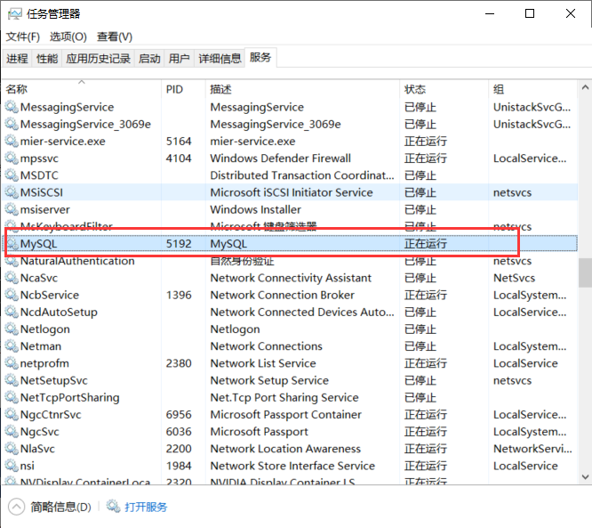
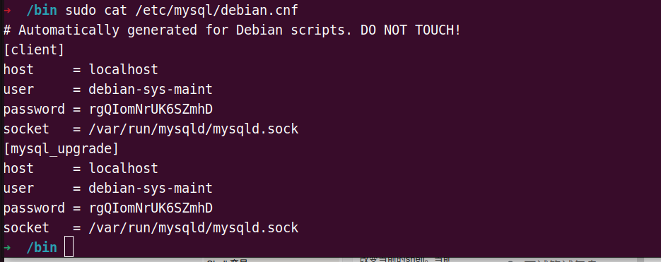
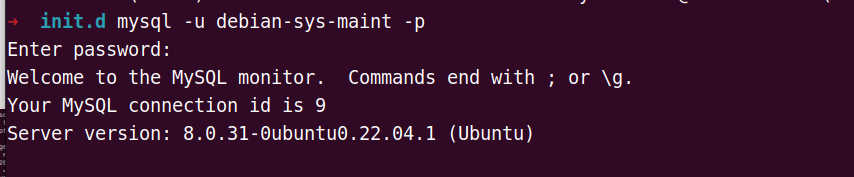

# MySQL安装问题文档

## 1. Windows环境

### 1.1 免安装MySQL注册服务

（1）首先第一步需要将mysqld服务进行注册

```shell
mysqld --install
```

如果没有这个命令，当执行`net start mysql`时，会提示**服务名无效** 

（2）注册成功后，则可以在任务管理器中看到相关服务



### 1.2 MySQL设置root初始密码

>  nuialsdu237*7$

（1）首先将mysqld服务关闭

```shell
net stop mysqld
```

（2）使用管理员权限打开CMD，然后重启mysqld

```shell
mysqld --skip-grant-table
```

同时另起一个管理员权限CMD，登录MySQL

```shell
mysql -u root -p // 直接回车，不输入登录密码
update user set authentication_string=password('新密码') where user='root';
```

（3）如何不知道MySQL在哪更新密码

```shell
use mysql; // 更换数据库
show tables; // 查看数据库中有哪些表
describe user; // 查看user表
update user set authentication_string=password('XXXX') where user='root'; // 更新相应字段
```

## 2. Linux环境

>  service mysql start

注意：以下配置文件，在安装mysql-server之后才会出现

当前密码： 

> nvajKKH.nj/123

两个点：

- mysql8版本不再支持password函数

- mysql8以后的版本，修改密码要使用alter，且指定**mysql_native_password**

> ALTER USER ‘root’@‘localhost’ IDENTIFIED WITH mysql_native_password BY ‘12345678’;

修改过程：

（1）

> cat /etc/mysql/debian.cnf



(2)

> mysql -u debian-sys-maint -p



(3)

```sql
mysql> use mysql;
Reading table information for completion of table and column names
You can turn off this feature to get a quicker startup with -A

Database changed
-------------
mysql> ALTER USER 'root'@'localhost' IDENTIFIED WITH mysql_native_password BY 'nvajKKH.nj/123';
ERROR 1396 (HY000): Operation ALTER USER failed for 'root'@'localhost'
mysql> update user set host = '%' where user ='root';
Query OK, 1 row affected (0.03 sec)
Rows matched: 1  Changed: 1  Warnings: 0

mysql> FLUSH PRIVILEGES;
Query OK, 0 rows affected (0.02 sec)

mysql>  ALTER USER 'root'@'localhost' IDENTIFIED WITH mysql_native_password BY 'nvajKKH.nj/123';
ERROR 1396 (HY000): Operation ALTER USER failed for 'root'@'localhost'

---------------------------------------------

mysql> drop user root@localhost;
Query OK, 0 rows affected (0.03 sec)

mysql> flush privileges;
Query OK, 0 rows affected (0.01 sec)

mysql> create user root@localhost identified by 'nvajKKH.nj/123'
    -> ;
Query OK, 0 rows affected (0.03 sec)

mysql>  ALTER USER 'root'@'localhost' IDENTIFIED WITH mysql_native_password BY 'nvajKKH.nj/123';
Query OK, 0 rows affected (0.01 sec)

mysql> flush privileges;
Query OK, 0 rows affected (0.01 sec)

mysql> exit
Bye
```

（4）

> sudo service mysql restart


参考：[mysql8碰到ERROR 1396 (HY000)的解决方案_微电子学与固体电子学-俞驰的博客-CSDN博客](https://blog.csdn.net/appleyuchi/article/details/113255257)
