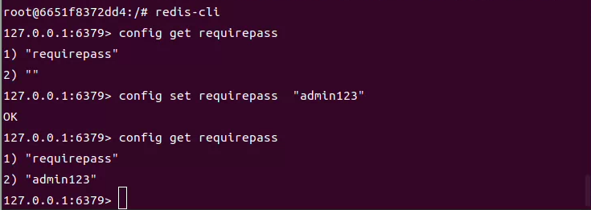

(1) 拉取最新redis

> docker pull redis:latest

(2) 查看本地镜像

> docker images

(3) 运行容器

> docker run -itd --name redis-test -p 6379:6379 redis

(5) 查看安装是否成功

> docker ps

> docker exec -it redis-test /bin/bash

(6)修改密码

- 登录客户端
  
  > redis-cli

- 查看现有密码
  
  > config get requirepass

- 设置密码
  
  > config set requirepass xxxx

