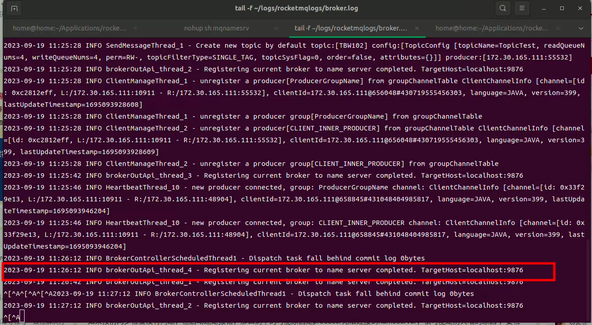
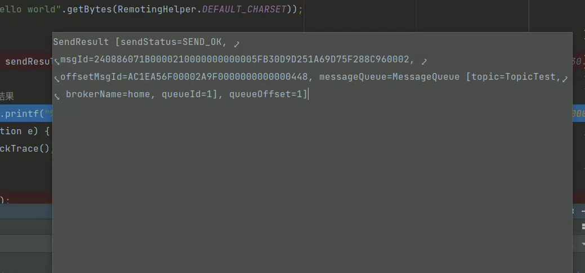

**启动namesrv**（nameserver 理解成zookeeper的效果）

后台执行，不要结束进程

> nohup sh mqnamesrv

**创建broker**(broker可以理解成RocketMQ本身)

后台执行，不要结束进程

> nohup sh mqbroker

创建Broker并自动创建Topic **(推荐使用)**

> nohup sh mqbroker -n localhost:9876 autoCreateTopicEnable=true

**报错：**

```
org.apache.rocketmq.client.exception.MQClientException: No route info of this topic: TopicTest
See http://rocketmq.apache.org/docs/faq/ for further details.
```

可能是nameserver中没有成功注册broker， 检查broker日志

> tail -f ~/logs/rocketmqlogs/broker.log





参考：

[RocketMQ 解决 No route info of this topic 异常步骤_IT_农厂的博客-CSDN博客](https://blog.csdn.net/chenaima1314/article/details/79403113)

[RocketMQ入门到入土（一）新手也能看懂的原理和实战！ - 开发者头条](https://toutiao.io/posts/jluhew1/preview)

---

**常用指令**

```
# sh bin/mqshutdown broker  //停止 broker

# sh bin/mqshutdown namesrv //停止 nameserver
```

查看集群情况`./mqadmin clusterList -n 127.0.0.1:9876`

查看 broker 状态 `./mqadmin brokerStatus -n 127.0.0.1:9876 -b 172.19.152.208:10911`(注意换成你的 broker 地址)

查看 topic 列表 `./mqadmin topicList -n 127.0.0.1:9876`

查看 topic 状态`./mqadmin topicStatus -n 127.0.0.1:9876 -t MyTopic`(换成你想查询的 topic)

查看 topic 路由`./mqadmin topicRoute -n 127.0.0.1:9876 -t MyTopic`
