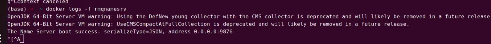
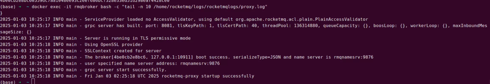
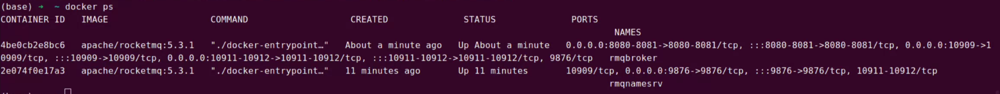

## docker部署rocketmq

1. 拉取镜像
   
   > docker pull apache/rocketmq:5.3.1

2. 创建容器共享
   
   Rocketmq中有多个服务，需要创建多个容器，**创建docker网络便于容器间互相通信**。

> docker network create rocketmq

3.     启动NameServer
   
   > docker run -d --name rmqnamesrv -p 9876:9876 --network rocketmq apache/rocketmq:5.3.1 sh mqnamesrv

4. 验证是否nameserver是否启动成功
   
   > docker logs -f rmqnamesrv



5. NameServer 成功启动后,启动 Broker 和 Proxy。
   
   ```shell
   # 配置 Broker 的IP地址
   echo "brokerIP1=127.0.0.1" > broker.conf
   
   # 启动 Broker 和 Proxy
   docker run -d \
   --name rmqbroker \
   --network rocketmq \
   -p 10912:10912 -p 10911:10911 -p 10909:10909 \
   -p 8080:8080 -p 8081:8081 \  -- 是一个看板，用不到不需要映射出来，里面服务起来的
   -e "NAMESRV_ADDR=rmqnamesrv:9876" \
   -v ./broker.conf:/home/rocketmq/rocketmq-5.3.1/conf/broker.conf \
   apache/rocketmq:5.3.1 sh mqbroker --enable-proxy \
   -c /home/rocketmq/rocketmq-5.3.1/conf/broker.conf
   
   # 验证 Broker 是否启动成功
   docker exec -it rmqbroker bash -c "tail -n 10 /home/rocketmq/logs/rocketmqlogs/proxy.log"
   ```
   
   

最后启动成功：




