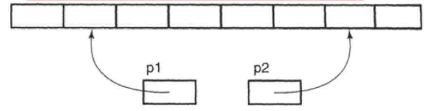

# C和指针

## 01 指针运算

指针运算的几种方式：

- 指针±整数
- 指针-指针

### 1.1 指针±整数

数组中的元素存储于连续的内存位置中，后面元素的地址大于前面元素的地址。因此，**我们很容易看出，对一个指针加1使它指向数组中下一个元素**，加5使它向右移动5个元素的位置，依次类推。把一个指针减去3使它向左移动3个元素的位置。对整数进行扩展保证对指针执行加法运算能产生这种结果，而不管数组元素的长度如何。

指针运算只有作用于数组中其结果才是可以预测的。**对任何并非指向数组元素的指针执行算术运算是非法的**（但常常很难被检测到）。如果一个指针减去一个整数后，运算结果产生的指针所指向的位置在数组第一个元素之前，那么它也是非法的。

### 1.2 指针-指针

只有当两个指针都指向同一个数组中的元素时，才允许从一个指针减去另一个指针。



两个指针相减的结果的类型是` ptrdiff_t`，它是一种有符号整数类型。减法运算的值是两个指针在内存中的距离（以数组元素的长度为单位，而不是以字节为单位），因为减法运算的结果将除以数组元素类型的长度。例如，如果`p1`指向`array[i]`而`p2`指向`array[j]`，那么`p2-p1`的值就是`j-i`的值。

如果两个指针都指向同一个数组中的元素，那么它们之间可以相减。指针减法的结果经过调整（除以数组元素类型的长度），表示两个指针在数组中相隔多少个元素。如果两个指针并不是指向同一个数组的元素，那么它们之间进行相减就是错误的。

### 1.3 指针比较

任何指针之间都可以进行比较，测试它们相等或不相等。如果两个指针都指向同一个数组中的元素，那么它们之间还可以执行`<`、`<=`、`>`和`>=`等关系运算，用于判断它们在数组中的相对位置。对两个不相关的指针执行关系运算，其结果是未定义的。

## 02  `const`和`define`区别

  C++ 语言可以用`const`来定义常量，也可以用 #define来定义常量。但是前者比后者有更多的优点：

（1）  `const`常量有数据类型，而宏常量没有数据类型。编译器可以对前者进行类型安全检查。而对后者只进行字符替换，没有类型安全检查，并且在字符替换可能会产生意料不到的错误（边际效应）。

（2）  有些集成化的调试工具可以对`const`常量进行调试，但是不能对宏常量进行调试。

## 03  常考题型

### 001 用变量a给出下面的定义.

a) 一个整型数
b) 一个指向整型数的指针
c) 一个指向指针的的指针，它指向的指针是指向一个整型数
d) 一个有10个整型数的数组
e) 一个有10个指针的数组，该指针是指向一个整型数的
f) 一个指向有10个整型数数组的指针
g) 一个指向函数的指针，该函数有一个整型参数并返回一个整型数
h) 一个有10个指针的数组，该指针指向一个函数，该函数有一个整型参数并返回一个整型数

```c
a) int a;
b) int *a;
c) int **a;
d) int a[10];
e) int *a[10];
f) int (*a)[10];
g) int (*a)(int);
h) int (*a[10])(int);
```

### 002 写一个“标准”宏MIN，这个输入两个参数并返回较小的一个

```c
#define Min(a,b) ( ((a)>=(b))?(b):(a))
```

### 003 引用和指针的区别？

- 1.引用必须要初始化，指针可以不用初始化；
- 2.不存在指向空值的引用，但是存在指向空值的指针；
- 3.引用初始化后不能改变，但指针初始化后可以改变；
- 4.引用是变量的别名，本身不单独分配自己的内存空间，而指针有自己的内存空间;

### 004 关键字`static`的作用是什么?

在c语言中`static`有三个明显的作用:

- **`static`在修饰局部变量**的时候，其使得**局部变量的生命周期发生改变，使得其放在`data`段，直到程序运行结束才结束。**
- **`static`在修饰全局变量**的时候，作用是**改变其作用域**，使得全局变量只能在定义的文件中使用
- `static`在修饰函数的时候，同样也**是只能使函数只能在当前的文件中使用**

### 005 C语言链表与数组的区别?

链表跟数组都属于一种数据结构-线性表。可以分为两个点来看：
**从逻辑结构来看**

- 数组必须事先定义固定的长度，不能适应数据动态地增减的情况。当数据增加时，可能超出原先定义的元素个数；当数据减少时，造成内存浪费；数组可以根据下标直接存取。
- 链表动态地进行存储分配，可以适应数据动态地增减的情况，且可以方便地插入、删除数据项。链表必须根据next指针找到下一个元素。

**从内存存储来看**

- 数组从**栈**中分配空间, 对于程序员方便快速,但是自由度小
- 链表从**堆**中分配空间, 自由度大但是申请管理比较麻烦

### 006 `#include <…h> `和`#include “…h” `有什么区别？

- 对于`#include <…h> `，编译器从**标准库路径**开始搜索`.h`， 系统标准库使用`<>`
- 对于`#include “…h” `，编译器从**用户的工作路径**开始搜索`.h`， 用户自定义的头文件使用`""`

### 007 同步与互斥的区别？

- **互斥：** 是指某一资源同时只允许一个访问者对其进行访问，但是互斥没有限制访问者对资源的访问顺序，即访问是无序的。使用信号量、互斥量来限制
- **同步：** 在互斥的基础上，通过其他机制实现访问者对资源的有限访问， 可以使用信号量的数组来限制访问顺序。

### 008 进程之间通信有哪些？

- 管道（`pipe`）：管道是一种半双工的通信方式，**数据只能单向流动**，**而且只能在具有血缘关系的进程间使用**。进程的血缘关系通常指父子进程关系。
- 有名管道（`named pipe`）：有名管道也是半双工的通信方式，但是**它允许无亲缘关系进程间通信**。
- 信号量（`semophore`）：信号量是一个计数器，**可以用来控制多个进程对共享资源的访问**。它通常作为一种锁机制，防止某进程正在访问共享资源时，其他进程也访问该资源。因此，主要作为进程间以及同一进程内不同线程之间的同步手段。
- 消息队列（`message queue`）：**消息队列是由消息组成的链表，存放在内核中并由消息队列标识符标识**.**消息队列克服了信号传递信息少，管道只能承载无格式字节流以及缓冲区大小受限等缺点**。
- 信号处理机制（`signal`）：信号是一种比较复杂的通信方式，用于**通知接收进程某一事件已经发生**。
- 共享内存（`shared memory`）：**共享内存就是映射一段能被其他进程所访问的内存，这段共享内存由一个进程创建，但多个进程都可以访问，共享内存是最快的`IPC`方式，它是针对其他进程间的通信方式运行效率低而专门设计的**。它往往与其他通信机制，如信号量配合使用，来实现进程间的同步和通信。
- 套接字（`socket`）：套接字也是一种进程间的通信机制，与其他通信机制不同的是**它可以用于不同机器间的进程通信**。

### 009 数组名和指针

```c
Char array1[100];
Char *array2;
```

**`array1 `和 `array2`都可以当作指针引动，但是他们在使用的时候有什么区别？？**

当`array1 `和` array2 `作为函数的参数传递的时候，数组可以当作指针使用，**本质上就是取数组第一个元素的内存地址传过去，该数组退化为同类型的指针**。

但是指针和数组两者本质上还是不一样的：

- 数组名对应着一块内存，而不是指向一块内存，其地址和容量在生命周期不变，但是数组内容可以改变。

- 指针可以随时随意指向其他的内存块，其特征可变，常用指针来操作动态内存。

### 010 头文件的`ifndef/define/endif`干什么用的？

防止头文件被重复引用

### 011 `sizeof` 与 `strlen` 的区别

`strlen` 是一个函数，它用来计算指定字符串` str` 的长度，**但不包括结束字符（即`\0`字符）**

```c
size_t strlen(char const* str);
```

**关键字` sizeof `是一个单目运算符**，而不是一个函数。与函数 `strlen` 不同，它的参数可以是数组、指针、类型、对象、函数等。

**`sizeof`用法注意：**

- 用于测定类型所占存储单元时，类型必须用`sizeof（类型）`

- 用于数组时，表示数组所占的存储空间的大小，可以不用`()`，即：`sizeof(name) = sizeof  name`，`name`为数组

- `sizeof`后面的对象如果是实参数组名，则结果为该数组的存储空间，但`sizeof`如果为一个指向数组首元素的指针，则**对于4字节地址的计算机系统，指针的大小为4字节**

### 012 函数指针与指针函数

#### 函数指针

**函数指针：** 一个指针， 指向函数的指针

具体描述：在C语言中，**一个函数总是占用一段连续的内存区，函数名就是该内存区的首地址**，我们可以把这个首地址赋予一个指针变量，通过指针变量来找到并调用这个函数。这个变量称为函数指针变量

```c
int (*p)(int *x, int *y);
```

**使用函数指针的好处**:可以将实现同一功能的多个模块统一起来标识，更容易进行后期维护

**使用：**

```c
int max(int a,int b){
    if(a>b)return a;
    else return b;
}
main(){
    int max(int a,int b);
    int(*pmax)(); //定义一个指针
    int x,y,z;
    pmax=max;//指向函数
    printf("input two numbers:\n");
    scanf("%d%d",&x,&y);
    z=(*pmax)(x,y);  //等价于z=max（x,y）
    printf("maxmum=%d",z);
}
```

#### 指针函数

**指针函数**：一个函数，返回值是指针的函数

```c
int *p(int a,int b);
```

### 013 程序的内存分配

- **栈区：** 由编译器自动分配释放，存放函数参数值、局部变量等
- **堆区：** 由程序员分配释放，程序结束后由操作系统回收（操作系统控制的链表）
- **静态变量区**： 初始化的全局变量和静态变量在这一块区域
- **常量区**： 存放常量与字符串等
- **程序代码区**： 存放函数体的二进制代码

**补充说明：**
1、栈中的变量内存会随着定义所在区间的结束自动释放；而对于堆，需要手动free，否则它就一直存在，直到程序结束；
2、对于静态存储区，其中的变量常量在程序运行期间会一直存在，不会释放，且变量常量在其中只有一份拷贝，不会出现相同的变量和常量的不同拷贝。

### 014 野指针

**野指针的成因一般有两种：**

- 指针变量没有被初始化：指针变量在刚创建时不会自动成为`NULL`指针，可能指向非法的内存。

- 指针变量被`free`或者`delete`之后，没有置为`NULL`，让人误以为p是一个合法的指针：`free`和`delete`只能释放指向的内存，但指向这块空间的指针仍然存在，只不过指向的是垃圾，在后面解引用会导致错误

### 015 编译原理

**编译过程：**

- **1 预处理：** 插入头文件，展开宏定义
- **2 编译：** 包括词法分析、语法分析、词义分析、代码优化和中间代码产生等，产生汇编文件。 `.i`文件生成`.s`文件
- **3 汇编：** 将汇编文件转化为二进制目标文件。` .s`文件生成`.obj`文件
- **4 链接：** 调用静态库（编译时加载）或者动态库（运行时加载）， 产生可执行文件。` .obj`文件和`.lib`静态链接库、`.dll`动态链接库生成可执行文件`.exe`

### 016 字符串常量和字符串数组的区别

在存储上有区别，字符串常量结尾有`\0`, 字符串数组结尾可以没有

### 017 全局变量和局部变量的区别

① 作用域不同： 全局变量作用域为整个程序；局部变量作用域为当前函数或者循环体

②内存存储方式不同：全局变量存储在全局数据区；局部变量存储在栈

③生命周期不同：全局变量的生命周期和主程序一样，随程序的销毁而销毁；局部变量如果在函数内部，函数调用结束则销毁，如果在循环体中，跳出循环体则被销毁

④使用方式不同：全局变量在声明后程序的各个地方都能用；但是局部变量只能在局部使用

### 018 `const int *a`, `int *const b ` 的区别

`const int *a  `表示a的内容不能被修改

`int * const b` 表示b所指向的内存地址不可变，不能改变指向

### 019 预编译

预编译又称为预处理，是做一些代码文本的替换工作，处理#开头的指令，比如拷贝#include包含的文件代码、#define宏定义的替换、条件编译等。

c提供的预处理功能主要有三种：

- 宏定义
- 文件包含
- 条件编译

### 020 const用法

`const int a;`  表示a是常量整形

`int const a;` 表示a是常量整形

`const int *a;` 表示执行常量整形的指针 ·(const int) *a; ·

`int * const a;` 表示指向整形数的常量指针(int *) const a; 相当于const (int *) a 

`int const * a const;` 表示指向常量整形的常量指针 (int const *) a const; 就相当于 const (int const *) a;

### 021 结构体和联合

联合的不同成员公用一块内存

结构体每个成员都有自己的内存空间

### 022 内存分配

静态存储区域的分配，内存在成语编译的时候已经分配好了，这块内存在程序运行期间都会存在

在栈上创建，在执行函数时，函数内局部变量的存储单元都可以在栈上创建，函数执行结束时这些存储单元自动被释放

在堆上创建，程序在运行的时候用malloc或者new申请任意多的内存，程序员自己负责free或者delete释放内存。
