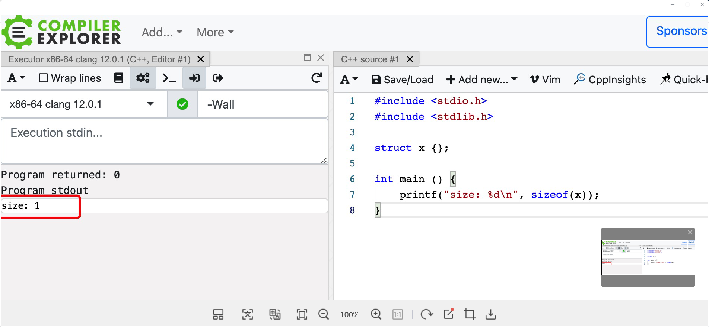
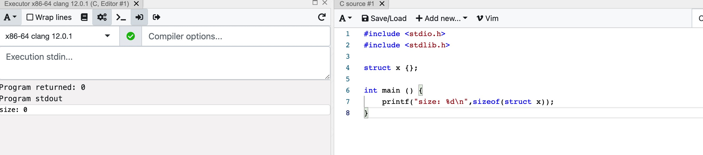

# 计算结构体大小

## 01 偏移量的概念

```c
struct stru{
    int a; // start address 0
    char b; // start address 4
    int c; // start address 8
}
```

偏移量是指： 结构体变量中成员的地址和结构体变量地址的差。 结构体大小等于最后一个成员的偏移量加上最后一个成员的大小。

显然，结构体变量中第一个成员的地址就是结构体变量的首地址，比如上边的结构体a的偏移量为0， b的偏移量是4.

## 02 地址对齐

在实际中，存储变量时地址要对齐，编译器再编译程序时遵循两条原则：

-  结构体变量中**成员的偏移量必须是成员大小的整数倍**
- **结构体大小必须是所有成员大小的整数倍**，也即所有成员大小的公倍数

```c
struct stru1  
{  
     int a;  //start address is 0
     char b;  //start address is 4
     int c;  //start address is 8
}; // sizeof(stru1) = 12
```

```c
 struct stru3  
{   
       char i;  //start address is 0 
       int m;   //start address is 4
       char n;  //start address is 8
};   // sizeof(stru3) = 12

struct stru4  
{  
       char i;  //start address is 0
       char n;  //start address is 1
       int m;  //start address is 4
 };// sizeof(stru4) = 8
```

## 03 嵌套的结构体, 需要展开结构体

- **<font color='red'>展开后的结构体的第一个成员的偏移量应当是被展开的结构体中最大的成员的整数倍。</font>**

- **<font color='red'>结构体大小必须是所有成员大小的整数倍，这里所有成员计算的是展开后的成员，而不是将嵌套的结构体当做一个整体。</font>**

例1： 

```c
struct stru5  
{  
      short i;  
      struct   
      {  
           char c;  
           int j;  
      } tt;   
      int k;  
};
```

展开后：

```c
struct stru5_t{
    short i;
    char c;
    int j;
    int k;
}
```

所以： `sizeof(stru5) = 16`

例2：

```c
struct stru6  
{  
      char i;  
      struct   
      {  
           char c;  
           int j;  
      } tt;   
      char a;  
      char b;  
      char d;  
      char e;  
      int f;  
};
```

展开后：

```c
struct stru6  
{  
      char i;  
      char c;  
      int j;  
      char a;  
      char b;  
      char d;  
      char e;  
      int f;  
};
```

`sizeof(stru6) = 16`

## 04 没有成员的结构体所占的空间？

- C语言中结构体占0字节

- C++中结构体占1字节

原因： C++标准规定，凡是一个独立的对象都必须具有非零大小，生成类对象时需要申请内存，0字节内存申请可能导致对象内存地址是无效的，因此**空类生成对象时编译器会主动插入一个char大小的数据**。

C++结果：



C语言结果：



**有时候有一些简单的代码，不想在本地搞，就可以用这玩意**

https://godbolt.org/
