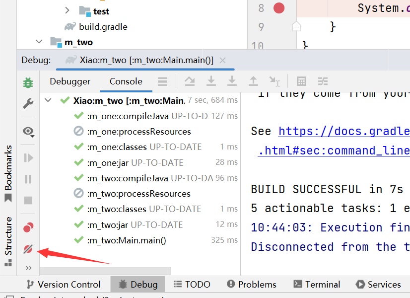
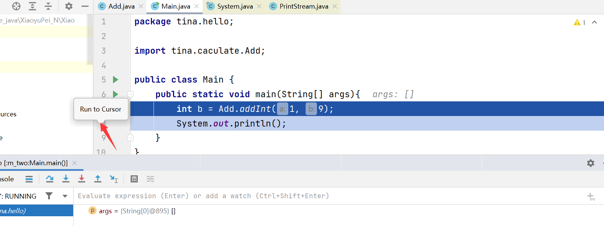

## 1. IDEA DEBUG 布局(windows笔记本有图，记得找下)

### 1.1  栈帧

### 1.2 操作按钮

（1） 进入函数

  （2）出函数

 

（3）强制进入某个函数

（4）下一步

### 1.3 相关配置

（1）重启一步到位

（2）断点

**这个比较重要：一出错立即断下**

(3)禁用断点（自己打的断点不想让生效）

## 2. 这个比较方便

当debug的时候，鼠标指针指向行数，然后单击会运行到指定的行。

