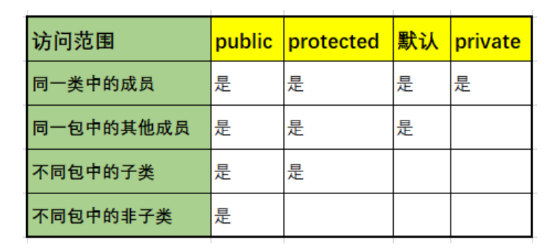

# 权限修饰符

**`private`/默认/`protected`/`public`权限修饰符和面向对象的三大特性的封装性有着密切关系**。它们都可以修饰类的成员，其中的**默认和`public`还可以修饰类**。

类的成员包括：成员变量、成员方法、构造方法、内部类、代码块。

`public`：修饰类可以被同一项目所有包中的所有类访问（类可见性）。

默认：可被同一包中的类访问（包可见性）
