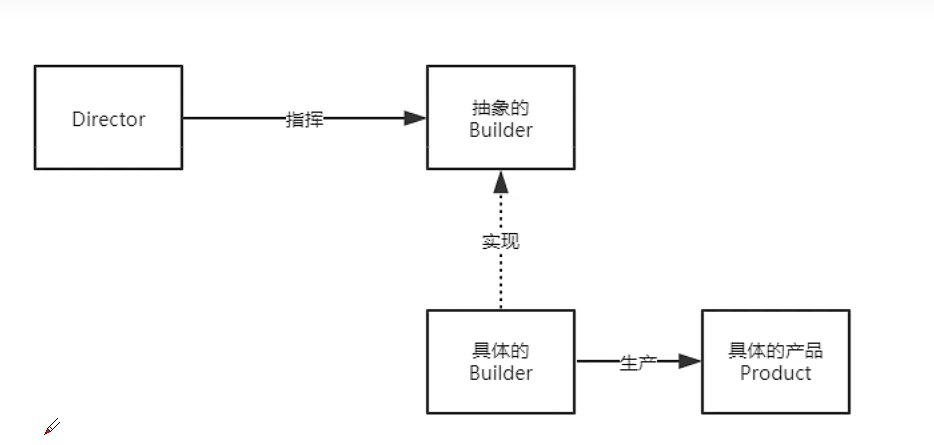

# 建造者模式

### 1. 定义

建造者模式也属于创建型模式，**它提供了一种创建对象得最佳方式**。

定义：讲一个复杂对象得构建与它的表示 分离，使得同样的构建过程可以创建不同的**表示**。

主要作用：再用户不知道 **对象的建造过程和细节**的情况下就可以直接创建复杂的对象。

用户只需要给出指定复杂对象的类型和内容，建造者模式负责按照顺序创建复杂对象（把内部的建造过程和细节隐藏起来）

### 2. 例子

- 工厂（创建者模式）：负责制造汽车（组装过程和细节在工厂内）

- 汽车购买者（用户）：你只需要说出你需要的型号（对象的类型和内容），然后直接购买就可以使用了。

### 3. 角色分析



### 4. 例子

```java
// 抽象的建造者
public abstract class Builder{
    abstract void buildA();
    abstract void buildB();
    // ...
    abstract Product getProduct();
}
```

```java
// 产品： 房子
public class Product{
    private String buildA;
    private String buildB;
    // ... 
}
```

```java
// 工人
public class Worker extends Builder{
    private Product product;
    public Worker(){
        product = new Product();
    }

    @Override
    abstract void buildA(){
        product.setBuildA("aaa");
    }
    @Override
    abstract void buildB(){
        product.setBuildB("bbb");
    }
    // ...
    @Override
    abstract Product getProduct(){
        return product;
    }
}
```

```java
// 指挥者， 核心， 负责指挥构建一个工程，工程如何构建，由它决定
public class Director{
    public Product build(Builder builder){
        builder.buildA();
        builder.buildB();
        // ...
        return builder.getProduct();
    }
}
```

```java
public class Test{
    public static void main(String[] args){
        Director director = new Director();
        Product product = director.build(new Worker();
        // 这就是构建和表示分离
    }
}
```

### 5. 总结

- 以上实例是Bulider模式的常规用法，**导演类Director**在Bulider模式中具有很重要的作用，它用于**指导具体构建这如何构建产品**，控制调用先后顺序，并向调用者返回完整的产品类，但是有些情况下需要简化系统结构，可以把`Director`和抽象建造者进行组合。

- 通过**静态内部类**方式实现零件无序装配构造，这种方式使用更加灵活，更符合定义。内部有复杂对象的默认实现，使用时可以根据用户需求自由定义更改内容，并且无需改变具体的构造方式。就可以生产出不同复杂产品。

#### 5.1 优点

- 产品的建造和表示分离，实现了解耦。使用建造者可以使客户端不必知道产品内部组成的细节。

- 讲复杂产品的创建步骤分解在不同的方法中，使得创建过程更加清晰

- 具体的建造者类之间是相互独立的，这有利于系统的扩展。

#### 5.2 缺点

- 建造者模式所创建的产品一般具有较多的共同点，其组成部分相似；如果产品之间的差异性很大，则不适合使用建造者模式，因此其使用范围收到一定的限制。

- 如果产品的内部变化复杂，可能会导致需要定义很多具体建造者类来实现这种变化，导致系统变得很庞大。

### 6. 应用场景

- 需要生成的产品对象有复杂的内部结构，这些产品对象具有共性

- 隔离复杂对象的创建和使用，并使得相同的创建过程可以创建不同的产品

- 适合于一个具有较多零件（属性）的产品（对象）的创建过程。
