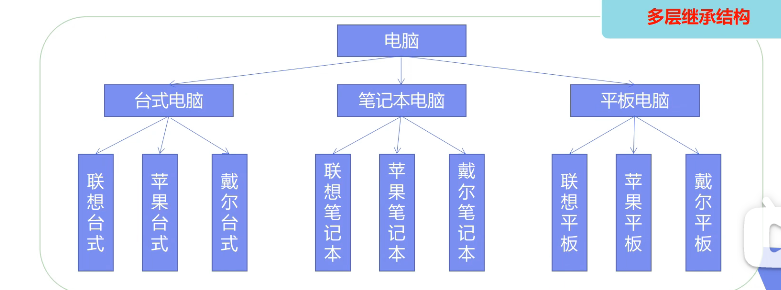
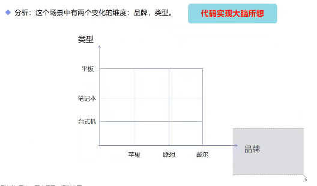
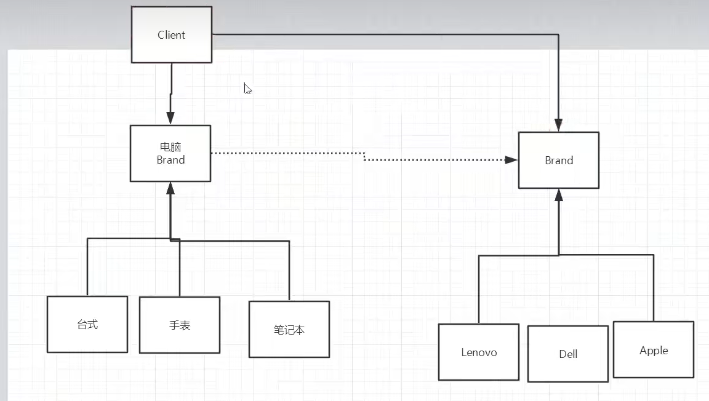

# 桥接模式bridge

### 1. 描述

桥接模式是讲抽象部分与它的实现部分分离，使他们都可以独立的变化，它使一种对象结构型模式，又被称为柄体模式或者接口模式。

将上面的多级抽象方式简化为以下：

用户使用的时候，需要电脑然后创建一个电脑，然后把品牌传进去，就得到了一个品牌的电脑。这样方便了很多。

### 2. 优缺点

#### 2.1 优势

- 桥接模式偶尔类似于多继承方案，但是多继承方案违背了类的单一职责原则，复用性比较差，类的个数也非常多，桥接模式使比多继承方案更好的解决方法，极大的减少了子类的个数，从而降低管理和维护的成本。

- 桥接模式提高了系统的可扩充性，在两个变化维度种任意扩展一个维度，都不需要修改原有系统，符合开闭原则，就像一座桥，可以把两个变化的维度连接起来。

#### 2.2 缺点

- 桥接模式的引入会增加系统的理解和设计难度，由于聚合关联关系建立在抽象层，要求开发者针对抽象进行设计和编程。

- 桥接模式要求正确识别出系统种的两个独立变化的维度，因此其使用范围具有一定的局限性。

### 3. 最佳实践

- 如果一个系统需要在构建的抽象化角色和具体化角色之间增加更多的灵活性，避免在两个层次之间建立静态的继承联系，通过桥接模式可以使他们在抽象层建立一个关联关系。抽象化角色和实现化角色可以以继承的方式独立扩展而互不影响，在程序运行时可以动态将一个抽象化子类的对象和一个实现化子类的对象进行组合，即系统需要对抽象化角色和实现化角色进行动态耦合。

- 一个类存在两个独立变化的维度，且者两个维度都需要进行扩展。

- 虽然在系统种使用继承时没问题的，但是由于抽象化角色和具体化角色需要独立变化，设计要求需要独立管理这两者。对于那些不希望使用继承或者因为多层次继承导致类的个数急剧增加的系统，桥接模式尤为适用。

### 4. 场景

- Java语言通过Java虚拟机实现了平台的无关性。

- AWT种的Peer架构。

- JDBC驱动程序也是桥接模式的应用之一。
