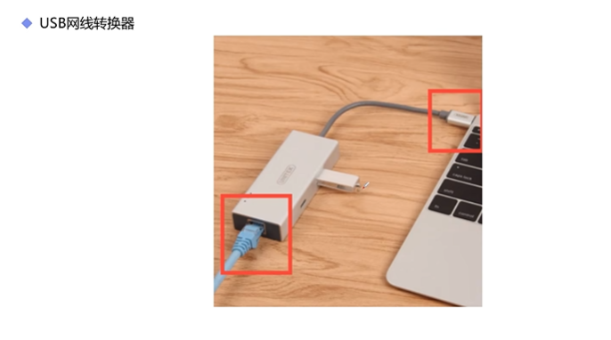
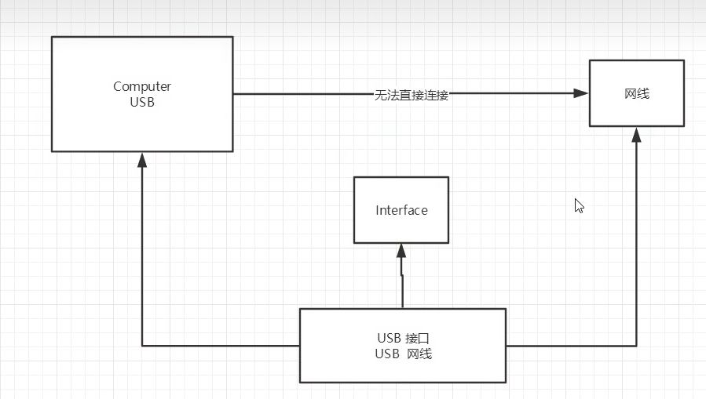

# 适配器模式

## 1. 结构型模式

### 1.1 作用

从程序的结构上实现**松耦合**，从而可以扩大整体的类结构，用来解决更大的问题

### 1.2 分类

- 适配器模式

- 代理模式

- 桥接模式

- 装饰模式

- 组合模式

- 外观模式

- 享元模式

## 2. 适配器模式



## 3. 例子

```java
// 要被适配的类， 就相当于网线
public class Adaptee{
    public void request(){
        System.out.println("连接网线上网");
    }
}
```

```java
// 电脑， 想上网插不上网线
public class Computer{
    // 电脑需要连接上转接器才可以上网
    public void net(NetToUsb adapter){
        // 上网的具体实现
        adapter.handleRequest();
    }

    public static void main(String[] args){
        Computer computer = new Compulter();
        Adapter adapter = new Adapter();
        Adaptee adaptee = new Adaptee();
        computer.net(adapter);
    }
}
```

```java
// 接口转换器的抽象实现
public interface NetToUsb{
    // 作用： 处理请求， 把网线插在USB上
    public void handleRequest();
}
```

```java
// 适配器
public class Adapter extends Adaptee implements NetToUsb{
    @Override
    public void handleRequest(){
        super.requset();
        // 可以上网了
    }

}
```



## 4. 角色分析

- 目标接口： 客户多期待的接口，目标可以是具体的或者抽象的类，也可以是接口

- 需要适配的类：需要适配的类或者是适配者类

- 适配器：通过包装一个需要适配的对象，把原接口转换成目标对象。

## 5. 优缺点

### 5.1 优点

- 一个对象适配器可以把多个不同的适配者适配到同一个目标

- 可以适配一个适配者的子类，由于适配器和适配者之间是关联关系，根据“里氏代换原则”， 适配者的子类可以通过该适配器进行适配

### 5.2 缺点

- 对于Java、C#等不支持多重类继承的语言，一次最多只能适配一个适配者类，不能同事适配多个适配者。

- 在Java、C#等语言中，适配器模式中的目标抽象类只能为接口，不能为类，其使用有一定的局限性。

## 6. 适用场景

- 系统需要使用一些现有的类，而这些类的接口（如方法名）不符合系统的需要，甚至没有这些类的源代码

- 想创建一个可以符合重复使用的类，用于与一些彼此之间没有太大关联的一些类。
