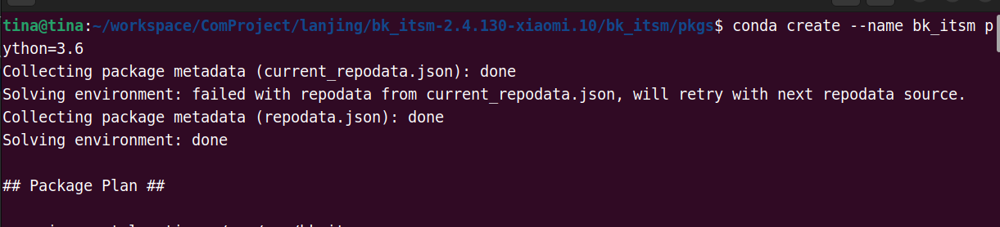
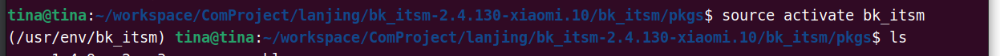
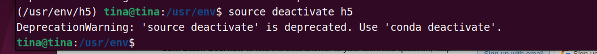

（1）创建虚拟环境

> conda create --name my_first_env python=3.6

（2）显示所有虚拟环境列表

> conda env list

 （3）进入虚拟环境

> conda activate env_name 

这里需要注意，ubuntu中没有conda activate 这个命令，需要改成

> source activate vir_name

（4）退出虚拟环境

> soure deactivate vir_name

