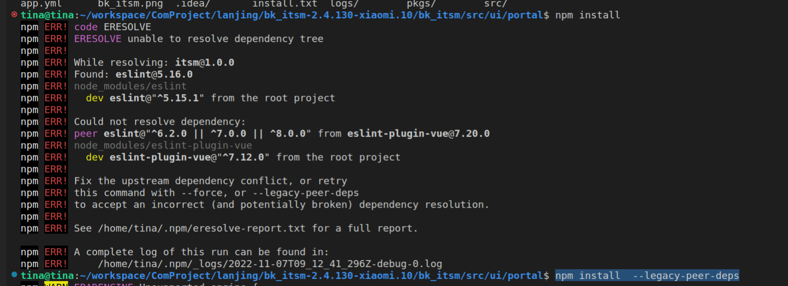

（1）安装本地包

> npm install ./path/XXX-npm

本地安装有两种安装方式:

- 开发依赖（代码比较多，不经过压缩，且有log信息）

- 生产依赖

（2）全局安装

> npm install -g xxx

**注意**: 通常，全局安装的包，包装在node目录下的node_modules下面。

（3）全局依赖报错

这个的问题是： 安装的项目中，依赖包被安装了多次产生了冲突，因此需要使用`--legacy-peer-deps`, 避免这个**核心依赖库被重复下载**的问题。

（4）如果有些包是需要本地下载的，下载下来后，可以直接拷贝到`node_modules`文件夹下面。
