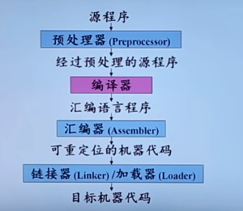

**机器语言：**

> C706 000 002

但是，都是二进制与十六进制。

**汇编语言：**

引入助记符， 例如：

> MOV X 2

但是助记符依赖于特定机器，非计算机专业人员使用受限制，编写效率仍然很低。

**高级语言：** （类似于数学符号）

> x = 2

-----

将高级语言转换为汇编语言或者机器语言的过程被称为： **编译** 

将汇编语言翻译为机器语言的过程被称为：汇编

