# 红黑树与AVL树

树的由来？？

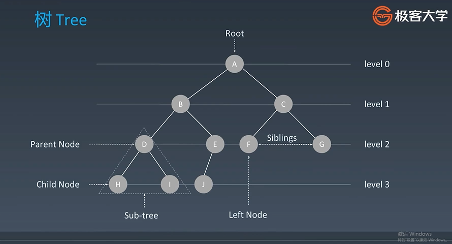

## 01 二叉树： 分叉， 分两个

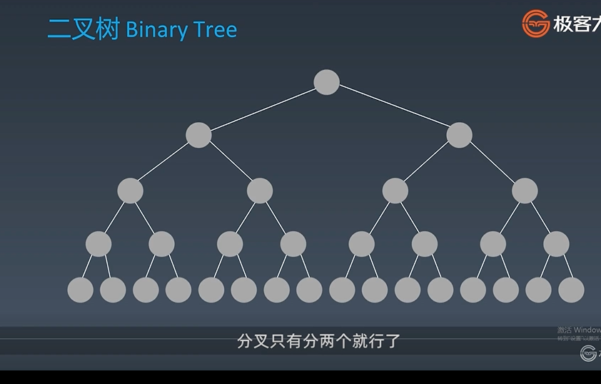

**二叉树的遍历:**

- 前序遍历 `pre_order` 根-左-右
- 中序遍历 `in_order` 左-根-右
- 后序遍历 `post_order` 左-右-根

**三种遍历方法代码如下：**

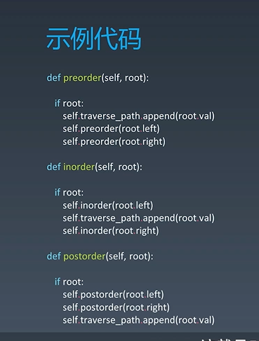

**注意：**

-  如果一个树是二叉搜索树，那么它的中序遍历是有序的

- 树和链表没有本质上的区别， 当一个链表分出左右两个`next`的时候， 我们可以把它称之为树,所以它的数据结构的本质就从一维空间扩散到二维空间了。

这种扩散的好处是什么？？ 引入了二叉搜索树， 这样查询就可以只走左分支，或者只走右分支， 这样查询的效率就从`O(N)`变成了`log2(N)`.

## 02 二叉搜索树

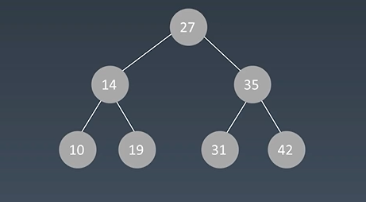

**特点：** 所有左子树的节点都小于根节点，所有右子树的节点都大于根节点，以此类推，左右子树也分别为二叉搜索树

**保证查询性能的关键：**

1.  保证二维维度！ -> 左右子树节点平衡
2. `Balanced`

所有的平衡二叉树有很多种，在面试的时候，一般喜欢给大家出`AVL` 和 红黑树， 自平衡二叉树

**如何保证平衡？？**

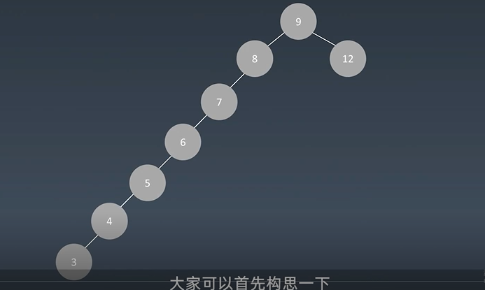

## 03 AVL

之所以叫AVL， 是因为它的发明者是`G.M.Adelson-Velsky `和 `Evgenii Landis`。

**平衡因子： `balance factor`**

平衡因子是它的左子树的高度减去它的右子树的高度（有时相反）。 `balance factor = {-1, 0, 1}`

**通过旋转操作来进行平衡（四种）**

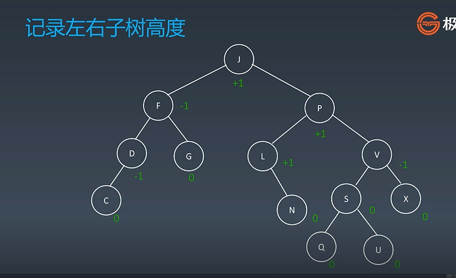

**旋转操作分为：**

- 左旋
- 右旋
- 左右旋
- 右左旋

**不足：** 节点需要存储额外信息、且调整次数频繁

### i 左旋

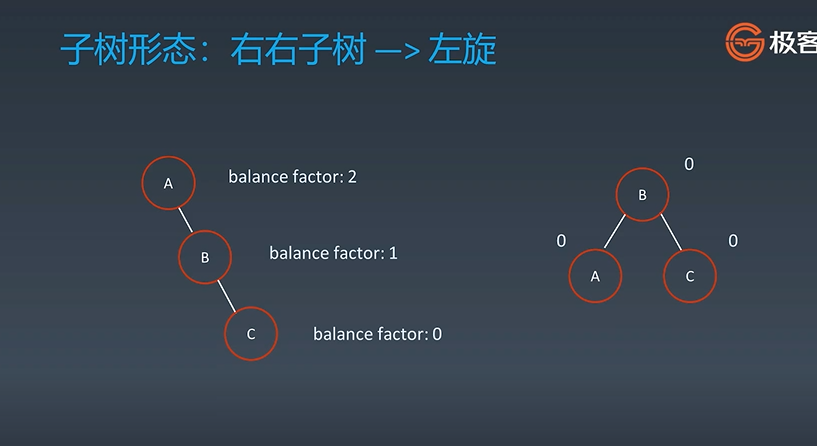

### j 右旋

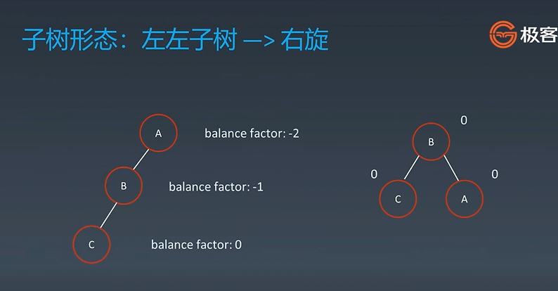

### k 左右旋

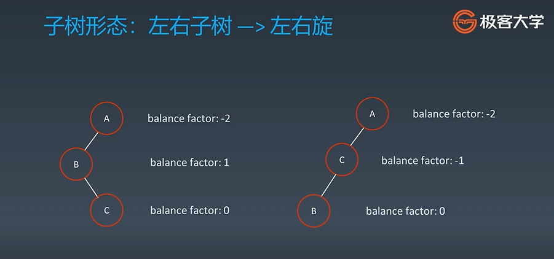

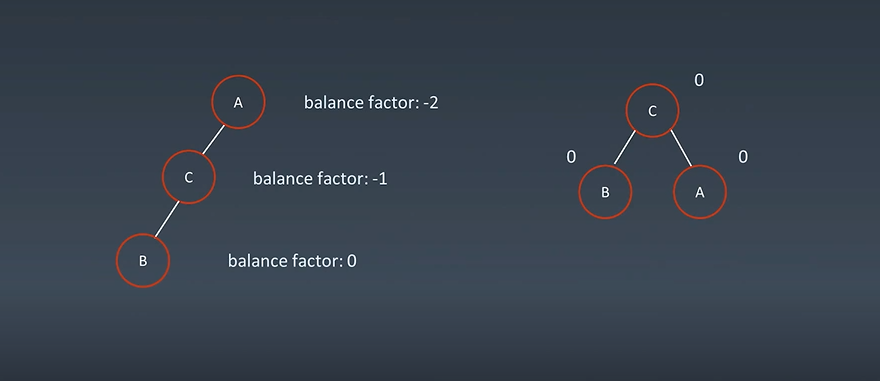

### h 右左旋

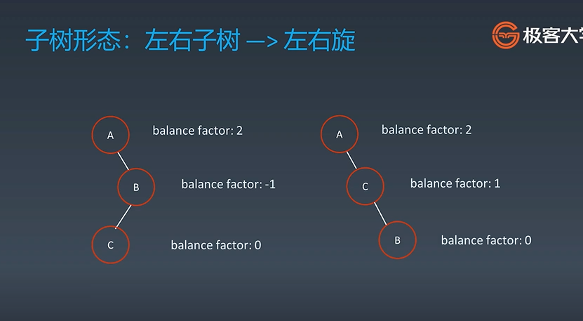

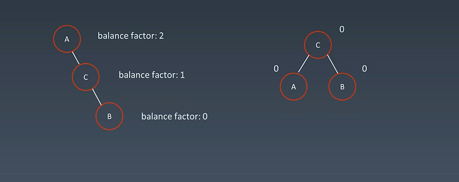

## 04 红黑树

红黑树是一种**近似平衡二叉树**， 为什么近似？ ->每次整理会浪费很多时间。

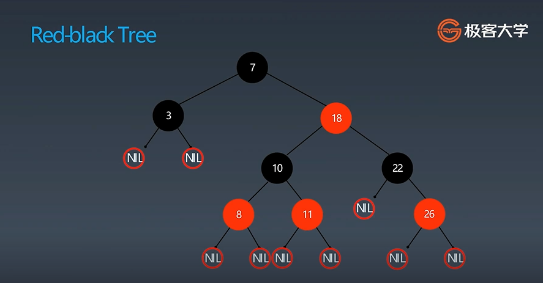

红黑树是一种**近似平衡**的二叉搜索树， 它能够确保任何一个节点的左右子树的**高度差小于两倍**， 具体来说， 红黑树是满足如下条件的二叉搜索树：

- 01 每个节点要么是红色，要么是黑色
- 02 根节点是黑色
- 03 每个叶节点（NIL节点，空结点）是黑色的
- 04 不能有相邻接的两个红色节点
- 05 从任一节点到其每个叶子的所有路径都包含相同数目的黑色节点。

**这五个条件只能背了。。。**这五个条件是怎么来的，就是发明红黑树的人牛皮的地方，他们都是计算机科学家。

第一条是废话

第二、三条要求根节点和空节点是黑色

第四五条说明了左右子树的高度差小于两倍

这五个性质也很好的说明，红黑树的时间复杂度平均来说还是`logN`, 不会退化，所需要的调整时间也是折中以后的调整时间。

## 05 红黑树与AVL比较

- 相比于红黑树，**`AVL`有更快的`lookups`(查询)**， 因为AVL是**更加严格平衡**的。
- 红黑树提供了**更快的插入和删除**操作，因为`AVL的旋转更多
- AVL**节点要存储信息的更多**一些，因为它要存储`factors `或者 `heights`。 红黑树只需要一个`bit`来存储代表红或黑

- 红黑树存在于一些高级语言的库中，比如说`map`，` set` 全部用的是红黑树。数据库中一般读的多，写的少，所以一般用的是`AVL`。

如果在读操作非常非常多，写操作很少的时候，就用`AVL`就好了。

`AVL`的问题就是插入和删除调整非常频繁，但是它的好处就是非常平衡，所以查询很快。

如果插入操作和查询操作一半一半的话，一般来说是使用红黑树，因为它的操作简单，

