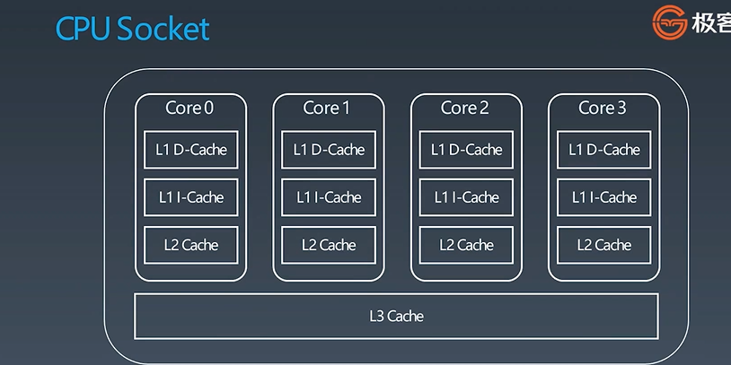
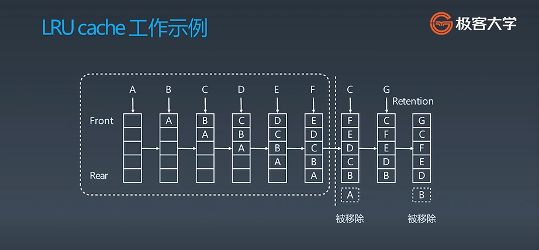

# LRU缓存

## 01 Cache 缓存

**01 缓存是什么？？**

- 人的记忆
- 钱包-储物柜
- 代码模块

**02 intel处理器：**

L1 cache、L2 cache、 L3cache三级缓存架构

**03 缓存的两点基本特性：**

- 大小
- 替换策略 -> `LRU`

## 02 LRU cache

**01 底层数据结构：` HashTabel + DoubleListedList`**

- `O(1)`查询

- `O(1)`修改、更新

**02 LRU cache 工作示例：**

## 03 替换策略

LRU：` least frequently used`

LFU： `least frequently used`

**题目：**

[146. LRU 缓存机制 - 力扣（LeetCode） (leetcode-cn.com)](https://leetcode-cn.com/problems/lru-cache/)
