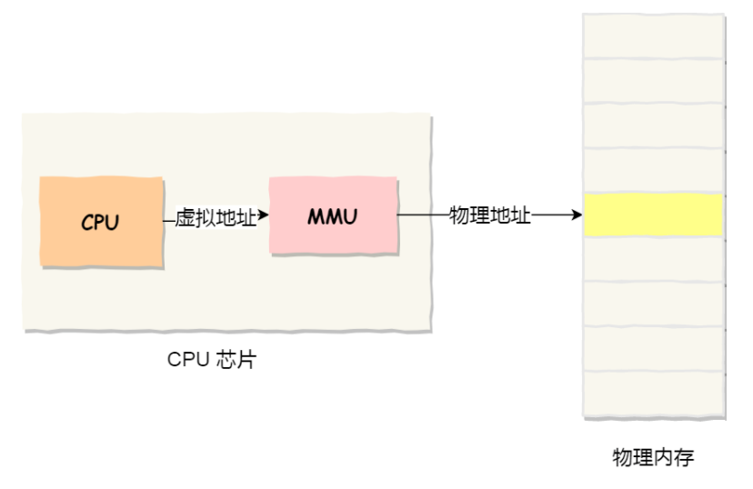

# 内存管理

## 01 内存管理的功能

### 1.1 内存的回收与分配

当作业或者进程创建后系统会为他们分配内存空间，结束后内存空间会被回收。

### 1.2 地址转换

将程序中的逻辑地址转换为内存中的物理地址

### 1.3 内存空间扩充

利用虚拟存储技术或者自动覆盖技术，从逻辑上扩充内存

### 1.4 存储保护

保证各个作为在自己的内存空间内运行，互不干扰。

##  02 程序执行过程

预处理、编译、链接、装入

预处理：

**编译：**

由编译程序将用户源代码编译成若干个目标模块

**链接：**

由链接程序将编译后的模块和所需要的库函数链接在一起，形成一个完整的装入模块。

**程序链接的三种方式：**

- 静态链接： 在程序运行之前，就将所有的模块和库函数链接在一起不分开。
- 装入时动态链接：将用户编译后的一组模块装入内存的时候，边链接边装入
- 运行时动态链接：在运行程序执行中需要哪些模块才将其链接装入，便于修改和更新

**装入：**

由装入程序将装入模块装入内存运行

### 2.1 虚拟地址和物理地址

**单片机的CPU是直接操作内存的物理地址**。

操作系统会提供一种机制，将不同进程的虚拟地址和不同内存的物理地址映射起来。

- **程序中所**使用的内存地址叫做**虚拟内存地址**
- 实际存在**硬件里**面的空间地址叫做**物理内存地址**

操作系统引入虚拟内存，进程持有的虚拟地址会通过CPU芯片中的内存管理单元（MMU）的映射关系，来转换为物理地址，然后再通过物理地址访问内存。

操作系统如何管理虚拟地址和物理地址的关系??

主要使用两种方式：**内存分段**和**内存分页**

## 03 内存保护

在分配内存的时候，**为了保证操作系统不受进程的影响**，同时**保证进程之间互不干扰**，从而引出了内存保护。

**方法：**

- 在CPU中设置一堆**上下限寄存器**，存放用户作业在主存中的上限地址与下限地址。**当CPU要访问内存的时候，分别用这两个地址和要访问的地址做比较**。
- **重定位寄存器和界地址寄存器**。重定位寄存器存储该作业的物理地址最小值；界地址寄存器存储该作业逻辑地址最大值。当CPU要访问内存的时候，分别用这两个地址数值之和与要访问的地址做比较。

## 04 扩充内存

覆盖与变换

### 4.1 覆盖

概念：由于程序在运行的时候并不是任何时候都要访问程序的所有数据和代码，所以可以**将用户空间分成一个固定区和如若干个覆盖区。将经常使用的程序段放在固定区(不会被调出)**。而那些**互斥使用的程序可以交替使用覆盖区**，如果不使用的话，会被调出内存。

### 4.2 变换

概念：把处于等待状态的**进程从内存移到辅存**，内存空间腾出来，这个叫做**换出**；把将要调用的进程在从辅存调到内存，这个过程叫做**换入**。

## 05 内存分配

### 5.1 连续分配

**连续分配是为用户分配一个连续的内存空间**，比如某个作业需要100MB的内存空间，就为这个作业在内存中划分一个100MB的内存空间。

**内部碎片和外部碎片**：

- **内部碎片**：**给一个进程分配一块空间**，**这块空间没有用完**的部分叫做内部碎片。
- **外部碎片**：**给每个进程分配空间以**后，**内存中**会存在一些**区域由于太小而无法利用**的空间，叫做外部碎片。

#### 5.1.1 单一连续分配

**分配方法**：将内存去划分为系统区域用户区，系统区为操作系统使用，剩下的用户区给**一个进程或作业**使用

**特点**：操作简单、没有外部碎片，适合单道处理系统。但是会有大量的内部碎片浪费资源，存储效率低。

#### 5.1.2 固定分区分配

#### 5.1.3 动态分区分配

**分配方法**：不会先划分内存区域，当进程进入内存的时候才会根据进程大小动态的为其建立分区，使分区大小刚好适合进程的需要。

**特点**：在开始是很好的，**进程一次按照顺序存入内存，但是运行久了以后随着进程的消亡，会出现很多成段的内存空间，时间越来越长就会导致很多不可利用的外部碎片**，降低内存的利用率。这时需要分配算法来解决

### 5.2 非连续分配

可以将一个进程**分散**的**装入**内存分区。根据分区的大小是否固定可以**分成分页存储管理**(固定)与**分段存储管理**(不固定)，为了避免两者的缺点，还可以二者混用成段页式存储管理。**再根据进程运行作业时是否将作业的的全部代码装入内存**，又分为基本分页存储管理(全部装入内存)和请求分页存储管理(非一次全装入内存)。

**页表**：为了便于在内存中找到进程的每个页面所对应的物理块，系统为每个进程建立一张页表，记录每个页面(进程中的块)在内存中的物理块号，一般放在内存中。页表项由两部分构成，第一部分存储页号，第二部分储存物理内存中的块号。

**进程中的块的各个代码，在内存中对应的物理地址是=页表中物理内存块号+地址结构中页内偏移量**

物理地址=页表中物理内存块号+地址结构中页内偏移量

## 06 虚拟内存

## 07 请求分页

有时间再慢慢搞。。。来不及了。。。