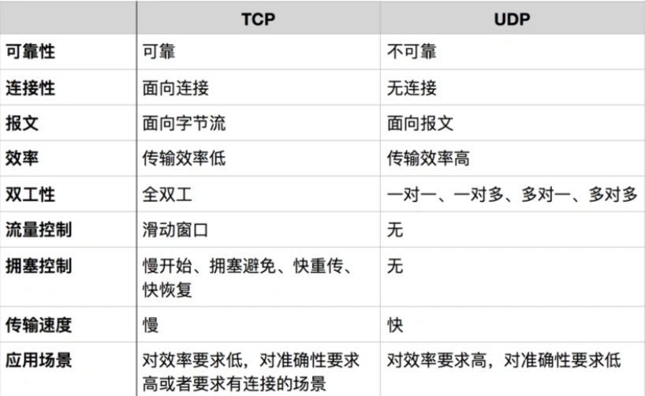

# TCP和UDP

TCP/IP 中有两个具有代表性的**传输层协议**，分别是 TCP 和 UDP。

对比TCP和UDP

## UDP

UDP常用于以下几个方面：

- 包总量较少的通信（DNS、SNMP【网络管理】）
- 视频、音频等多媒体通信（即时通信）
- 现定于LAN等特定网络的应用通信
- 广播通信（广播、多播）

## TCP

TCP常用于：

- 电子邮件
- 远程终端接入
- HTTP
- 文件传输

