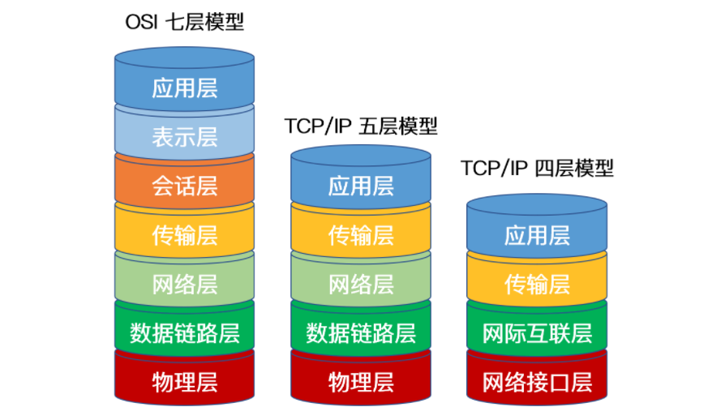
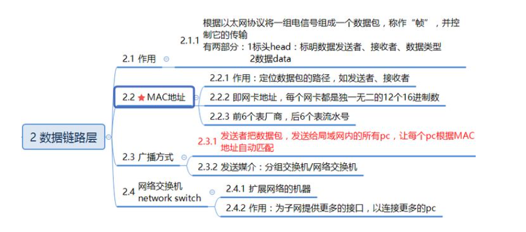
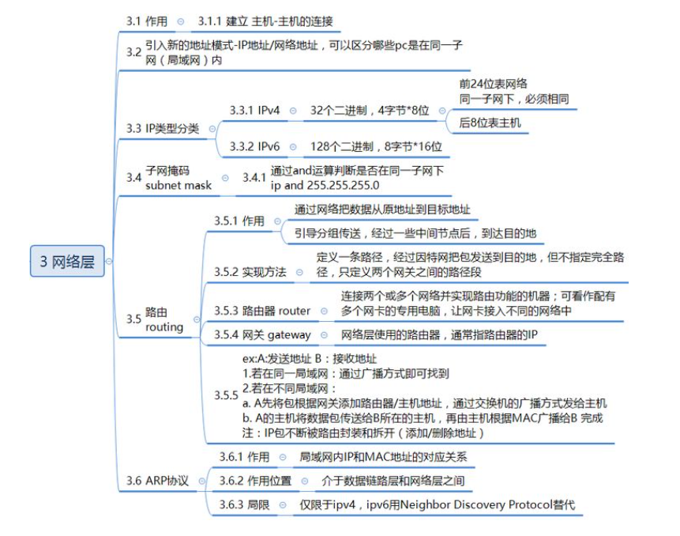
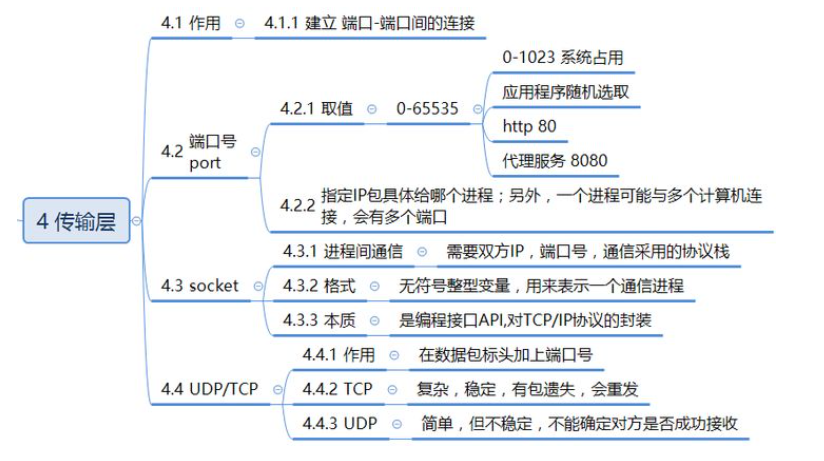
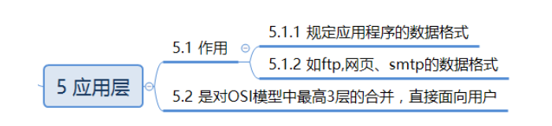
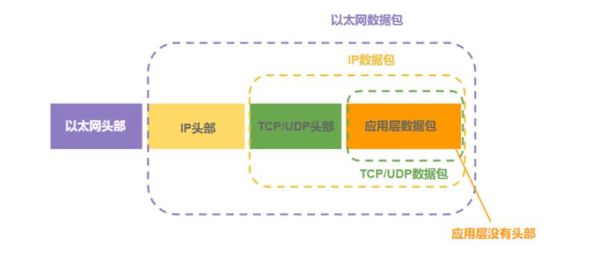

# 协议层次

## 1. `OSI`七层模型

记忆点： **“物联网叔会使用”** 

### 1.1 物理层

物理层地作用是实现**计算机节点之间地比特流的透明传输**，尽可能屏蔽掉具体传输介质和物理设备的差异，使上层协议不必考虑网络传输介质时什么，为上层提供一致接口。

对应的协议：` IEEE 802.1A`, `IEEE802.2 - IEEE802.11`

### 1.2 数据链路层

#### 1.2.1 描述

两台主机之间的数据传输，总是在**一段一段的链路上传送**，这就需要使用专门的**链路层协议**。两个相邻节点之间传送数据时，数据链路层将网络层交下来的`IP`数据包组装成帧（数据+标头：发送者、接收者、数据类型 ），在两个相邻节点之间的链路上传输。

**作用：** 组装帧，并控制帧的传输。

### 1.3 网络层

#### 1.3.1 描述

**两台计算机之间传送数据**时其通信链路往往不止一条，所传输的信息甚至可能经过很多通信子网。网络层的主要任务就是选择合适的网间路由和交换节点，确保数据按时成功传送。

**在发送数据时，网络层把传输层产生的报文或用户数据报封装成分组和包向下传输到数据链路层**。在网络层使用的协议是无连接的网际协议和许多路由协议，因此我们通常把该层简单地称为 `IP` 层。

**作用：** 建立两台计算机之间的连接

#### 

### 1.4 传输层

#### 1.4.1 描述

传输层的主要任务是**为两台主机进程之间的通信提供服务**。应用程序利用该服务传送应用层报文。该服务并不针对某一特定的应用，多种应用可以使用同一个传输层服务。由于一台主机可同时运行多个线程，因此传输层有复用和分用的功能。所谓复用就是指多个应用层进程可同时使用下面传输层的服务，分用和复用相反，是传输层把收到的信息分别交付上面应用层中的相应进程。

**作用：** 两台主机进程之间的通信提供服务

### 1.5 会话层

**会话层就是负责建立、管理和终止表示层实体之间的通信会话。**该层提供了数据交换的定界和同步功能，包括了建立检查点和恢复方案的方法。

### 1.6 表示层

**表示层的作用是使通信的应用程序能够解释交换数据的含义**，其位于 `OSI` 参考模型的第六层，向上为应用层提供服务，向下接收来自会话层的服务。该层提供的服务主要包括数据压缩，数据加密以及数据描述。这使得应用程序不必担心在各台计算机中表示和存储的内部格式差异。

### 1.7 应用层

其作用是通**过应用程序间的交互来完成特定的网络应用**。该层协议定义了应用进程之间的交互规则，通过不同的应用层协议为不同的网络应用提供服务。例如域名系统 `DNS`，支持万维网应用的 `HTTP `协议，电子邮件系统采用的` SMTP `协议等。在应用层交互的数据单元我们称之为报文。

### 1.8 数据包结构

