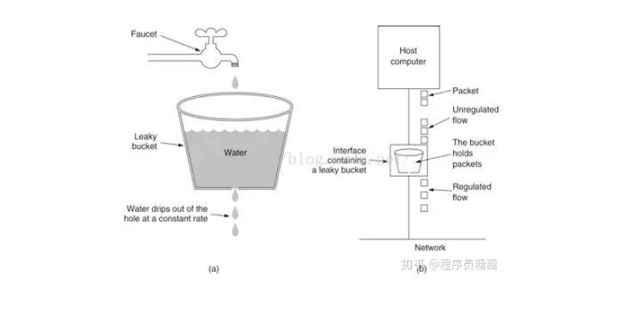
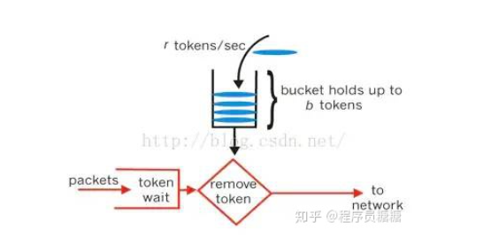
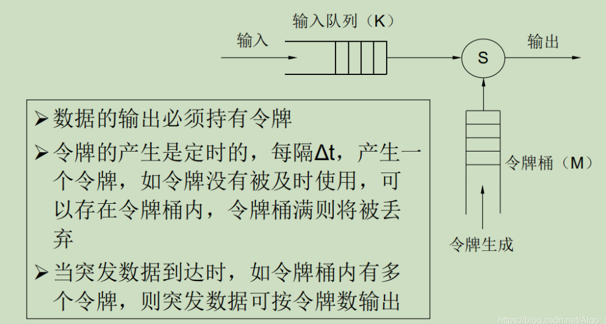

## 流量控制算法（限流算法）

主要有：

1. 漏桶算法：平滑输入流量，控制进入网络的流量
2. 令牌桶算法：当大的突发流量到来时，输出也能有适当响应

### 漏桶算法

漏桶算法思路很简单，请求先进入到漏桶里，漏桶以固定的速度出水，也就是处理请求，当水加的过快，则会直接溢出，也就是拒绝请求，可以看出漏桶算法能强行限制数据的传输速率。

适合输入数据为**匀速的输入的情况**

**缺点**：

- 漏桶满，造成数据丢失。
- 漏桶算法强迫输出保持一个固定的平均速率，不能 体现通信量的突发

### 令牌桶

令牌桶算法的原理是系统会以一个恒定的速度往桶里放入令牌，而如果请求需要被处理，则需要先从桶里获取一个令牌，当桶里没有令牌可取时，则拒绝服务。

令牌桶算法是网络流量整形和速率限制中最常使用的一种算法。典型情况下，令牌桶算法用来控制发送到网络上的数据的数目，并**允许突发数据的发送**。

大小固定的令牌桶可自行**以恒定的速率源源不断地产生令牌**。如果令牌不被消耗，或者被消耗的速度小于产生的速度，令牌就会不断地增多，直到把桶填满。后面再产生的令牌就会从桶中溢出。最后桶中可以保存的最大令牌数永远不会超过桶的大小。

**传送到令牌桶的数据包需要消耗令牌。不同大小的数据包**，消耗的令牌数量不一样。令牌桶这种控制机制基于令牌桶中是否存在令牌来指示什么时候可以发送流量。令牌桶中的每一个令牌都代表一个字节。如果令牌桶中存在令牌，则允许发送流量；而如果令牌桶中不存在令牌，则不允许发送流量。因此，如果突发门限被合理地配置并且令牌桶中有足够的令牌，那么流量就可以以峰值速率发送。