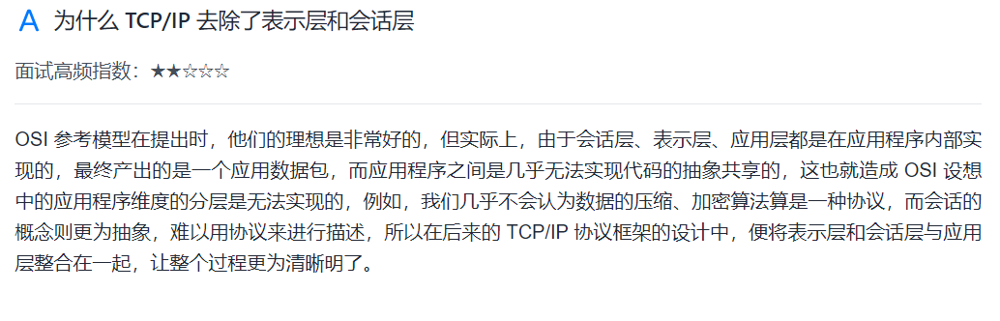
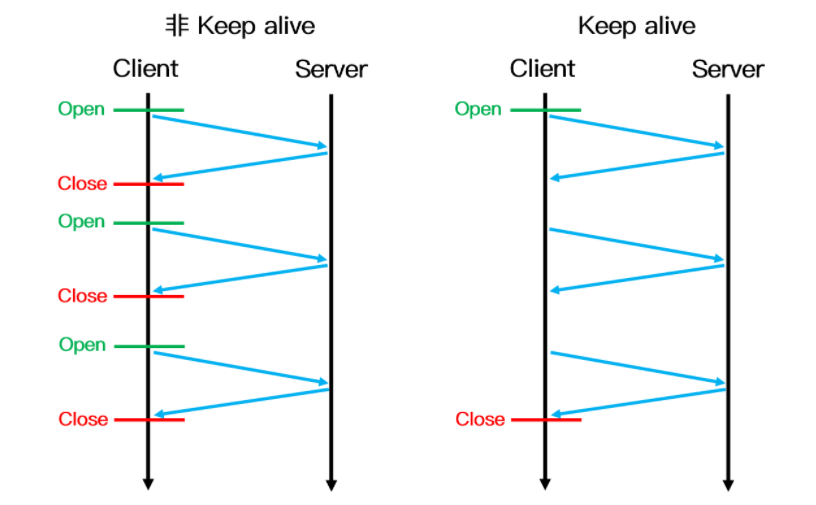
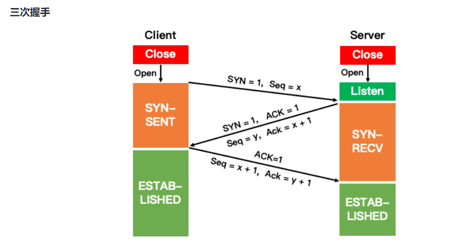

# 计算机网络总结

### 1. Keep-Alive 和非 Keep-Alive 区别，对服务器性能有影响吗

​    在早期的 HTTP/1.0 中，浏览器每次 发起 HTTP 请求都要与服务器创建一个新的 TCP 连接，服务器完成请求处理后立即断开 TCP 连接，服务器不跟踪每个客户也不记录过去的请求。然而创建和关闭连接的过程需要消耗资源和时间，为了减少资源消耗，缩短响应时间，就需要重用连接。在 HTTP/1.1 版本中默认使用持久连接，在此之前的 HTTP 版本的默认连接都是使用非持久连接，如果想要在旧版本的 HTTP 协议上维持持久连接，则需要指定 connection 的首部字段的值为 Keep-Alive 来告诉对方这个请求响应完成后不要关闭，下一次咱们还用这个请求继续交流，我们用一个示意图来更加生动的表示两者的区别：

​    对于非 Keep-Alive 来说，必须为每一个请求的对象建立和维护一个全新的连接。对于每一个这样的连接，客户机和服务器都要分配 TCP 的缓冲区和变量，这给服务器带来的严重的负担，因为一台 Web 服务器可能同时服务于数以百计的客户机请求。在 Keep-Alive 方式下，服务器在响应后保持该 TCP 连接打开，在同一个客户机与服务器之间的后续请求和响应报文可通过相同的连接进行传送。甚至位于同一台服务器的多个 Web 页面在从该服务器发送给同一个客户机时，可以在单个持久 TCP 连接上进行。

​    然而，Keep-Alive 并不是没有缺点的，当长时间的保持 TCP 连接时容易导致系统资源被无效占用，若对 Keep-Alive 模式配置不当，将有可能比非 Keep-Alive 模式带来的损失更大。因此，我们需要正确地设置 keep-alive timeout 参数，当 TCP 连接在传送完最后一个 HTTP 响应，该连接会保持 keepalive_timeout 秒，之后就开始关闭这个链接。

### 2. HTTP 长连接短连接使用场景是什么

**长连接**：多用于操作频繁，点对点的通讯，而且客户端连接数目较少的情况。例如即时通讯、网络游戏等。

**短连接**：用户数目较多的Web网站的 HTTP 服务一般用短连接。例如京东，淘宝这样的大型网站一般客户端数量达到千万级甚至上亿，若采用长连接势必会使得服务端大量的资源被无效占用，所以一般使用的是短连接。

### 3. GET 和 POST 的区别

- get 提交的数据会放在 URL 之后，并且请求参数会被完整的保留在浏览器的记录里，由于参数直接暴露在 URL 中，可能会存在安全问题，因此往往用于获取资源信息。而 post 参数放在请求主体中，并且参数不会被保留，相比 get 方法，post 方法更安全，主要用于修改服务器上的资源。
- get 请求只支持 URL 编码，post 请求支持多种编码格式。
- get 只支持 ASCII 字符格式的参数，而 post 方法没有限制。
- get 提交的数据大小有限制（这里所说的限制是针对浏览器而言的），而 post 方法提交的数据没限制
- get 方式需要使用 `Request.QueryString` 来取得变量的值，而 post 方式通过 `Request.Form` 来获取。
- get 方法产生一个 TCP 数据包，post 方法产生两个（并不是所有的浏览器中都产生两个）。

### 4. DNS 为什么用 UDP

更正确的答案是 D**NS 既使用 TCP 又使用 UDP**。

​    当进行区域传送（主域名服务器向辅助域名服务器传送变化的那部分数据）时会使用 TCP，因为数据同步传送的数据量比一个请求和应答的数据量要多，而 TCP 允许的报文长度更长，因此为了保证数据的正确性，会使用基于可靠连接的 TCP。

​    当客户端向 DNS 服务器查询域名 ( 域名解析) 的时候，一般返回的内容不会超过 UDP 报文的最大长度，即 512 字节。用 UDP 传输时，不需要经过 TCP 三次握手的过程，从而大大提高了响应速度，但这要求域名解析器和域名服务器都必须自己处理超时和重传从而保证可靠性。

### 5. socket() 套接字有哪些

套接字（Socket）是对网络中不同主机上的应用进程之间进行双向通信的端点的抽象，网络进程通信的一端就是一个套接字，不同主机上的进程便是通过套接字发送报文来进行通信。例如 TCP 用主机的 IP 地址 + 端口号作为 TCP 连接的端点，这个端点就叫做套接字。

套接字主要有以下三种类型：

- 流套接字（SOCK_STREAM）：流套接字基于 TCP 传输协议，主要用于提供面向连接、可靠的数据传输服务。由于 TCP 协议的特点，使用流套接字进行通信时能够保证数据无差错、无重复传送，并按顺序接收，通信双方不需要在程序中进行相应的处理。
- 数据报套接字（SOCK_DGRAM）：和流套接字不同，数据报套接字基于 UDP 传输协议，对应于无连接的 UDP 服务应用。该服务并不能保证数据传输的可靠性，也无法保证对端能够顺序接收到数据。此外，通信两端不需建立长时间的连接关系，当 UDP 客户端发送一个数据给服务器后，其可以通过同一个套接字给另一个服务器发送数据。当用 UDP 套接字时，丢包等问题需要在程序中进行处理。
- 原始套接字（SOCK_RAW）：由于流套接字和数据报套接字只能读取 TCP 和 UDP 协议的数据，当需要传送非传输层数据包（例如 Ping 命令时用的 ICMP 协议数据包）或者遇到操作系统无法处理的数据包时，此时就需要建立原始套接字来发送。

### 6. 三次握手和四次挥手机制

三次握手是 TCP 连接的建立过程。**在握手之前，主动打开连接的客户端结束 CLOSE 阶段，被动打开的服务器也结束 CLOSE 阶段，并进入 LISTEN 阶段。随后进入三次握手阶段**：

**① 首先客户端向服务器发送一个 SYN 包，并等待服务器确认，**其中：

​    标志位为 SYN，表示请求建立连接；
​    序号为 Seq = x（x 一般取随机数）；
​    随后客户端进入 SYN-SENT 阶段。
**② 服务器接收到客户端发来的 SYN 包后，对该包进行确认后结束 LISTEN 阶段，并返回一段 TCP 报文，**其中：

​    标志位为 SYN 和 ACK，表示确认客户端的报文 Seq 序号有效，服务器能正常接收客户端发送的数据，并同意创建新连接；
​    序号为 Seq = y；
​    确认号为 Ack = x + 1，表示收到客户端的序号 Seq 并将其值加 1 作为自己确认号 Ack 的值，随后服务器端进入 SYN-RECV 阶段。
**③ 客户端接收到发送的 SYN + ACK 包后，明确了从客户端到服务器的数据传输是正常的，从而结束 SYN-SENT 阶段。并返回最后一段报文。**其中：

​    标志位为 ACK，表示确认收到服务器端同意连接的信号；
​    序号为 Seq = x + 1，表示收到服务器端的确认号 Ack，并将其值作为自己的序号值；
​    确认号为 Ack= y + 1，表示收到服务器端序号 seq，并将其值加 1 作为自己的确认号 Ack 的值。
​    随后客户端进入 ESTABLISHED。
当服务器端收到来自客户端确认收到服务器数据的报文后，得知从服务器到客户端的数据传输是正常的，从而结束 SYN-RECV 阶段，进入 ESTABLISHED 阶段，从而完成三次握手。

### 7. 为什么要进行三次握手？两次握手可以吗？

​    三次握手的主要目的是确认自己和对方的发送和接收都是正常的，从而保证了双方能够进行可靠通信。若采用两次握手，当第二次握手后就建立连接的话，此时客户端知道服务器能够正常接收到自己发送的数据，而服务器并不知道客户端是否能够收到自己发送的数据。

​    我们知道网络往往是非理想状态的（存在丢包和延迟），当客户端发起创建连接的请求时，如果服务器直接创建了这个连接并返回包含 SYN、ACK 和 Seq 等内容的数据包给客户端，这个数据包因为网络传输的原因丢失了，丢失之后客户端就一直接收不到返回的数据包。由于客户端可能设置了一个超时时间，一段时间后就关闭了连接建立的请求，再重新发起新的请求，而服务器端是不知道的，如果没有第三次握手告诉服务器客户端能否收到服务器传输的数据的话，服务器端的端口就会一直开着，等到客户端因超时重新发出请求时，服务器就会重新开启一个端口连接。长此以往， 这样的端口越来越多，就会造成服务器开销的浪费。

### 8. CLOSE-WAIT 和 TIME-WAIT 的状态和意义

**CLOSE_WAIT 是服务端发出第一次挥手**(整体第二次)进入的状态,表示"我准备关闭了,但是还有自己的事情处理一下,你等我处理完"
等服务器处理好自己的数据业务,则表示我准备好了,再发送 fin 包

**TIME_WAIT是第四次挥手后,客户端进入的状态,是客户端必要的等待时间**,目的是等待:1-服务端的对应端口关闭与客户端发送到服务端的数据到达(可能**出现延迟),如果不存在这个步骤就会导致两个问题:**

- 客户端立即关闭后,立即又用同样的端口握手并建立通信,此时上次的连接残留的数据包会被误认为是本次的,造成数据异常
- 客户端直接关闭后,若服务端重新发送 fin 包,客户端就会回应 RST,会报异常,但是其实是没有问题的

### 9. TIME-WAIT 为什么是 2MSL

​    当客户端发出最后的 ACK 确认报文时，并不能确定服务器端能够收到该段报文。所以客户端在发送完 ACK 确认报文之后，会设置一个时长为 2 MSL 的计时器。MSL（Maximum Segment Lifetime），指一段 TCP 报文在传输过程中的最大生命周期。2 MSL 即是服务器端发出 FIN 报文和客户端发出的 ACK 确认报文所能保持有效的最大时长。

​    若服务器在 1 MSL 内没有收到客户端发出的 ACK 确认报文，再次向客户端发出 FIN 报文。如果客户端在 2 MSL 内收到了服务器再次发来的 FIN 报文，说明服务器由于一些原因并没有收到客户端发出的 ACK 确认报文。客户端将再次向服务器发出 ACK 确认报文，并重新开始 2 MSL 的计时。

​    若客户端在 2MSL 内没有再次收到服务器发送的 FIN 报文，则说明服务器正常接收到客户端 ACK 确认报文，客户端可以进入 CLOSE 阶段，即完成四次挥手。

​    **所以客户端要经历 2 MSL 时长的 TIME-WAIT 阶段，为的是确认服务器能否接收到客户端发出的 ACK 确认报文。**
